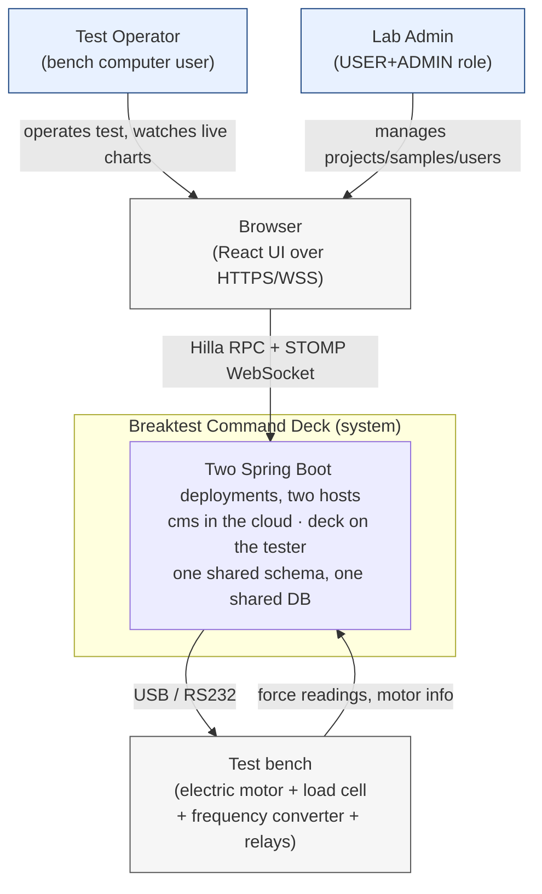
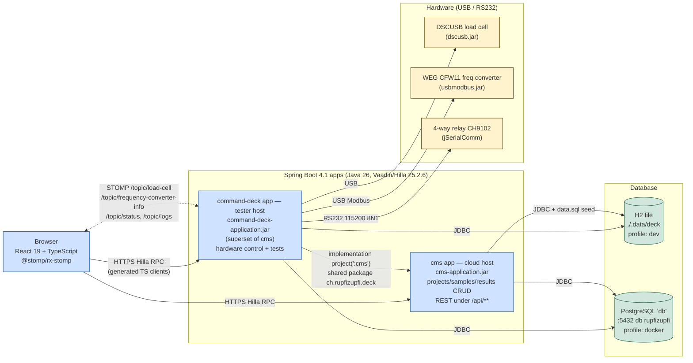

> Branch: `dev-split` — captured 2026-08-17.

# System architecture

C4-style high-level view. Detail per layer lives in
[`02-modules/`](../02-modules/), [`03-backend/`](../03-backend/) and
[`04-frontend/`](../04-frontend/).

## Contents

- [Context](#context)
- [Containers](#containers)
- [Reading guide](#reading-guide)
- [Fresh-clone quickstart](#fresh-clone-quickstart)
- [Where to look in the code](#where-to-look-in-the-code)

## Context

Who talks to the system, what's outside its trust boundary.



Source: [`doc/diagrams/src/c4-context.mmd`](../diagrams/src/c4-context.mmd).

## Containers

What's deployed, what runs where. **`cms` is deployed to a cloud host;
`command-deck` runs on the machine physically wired to the test bench.**
Both use the `docker` Spring profile and both are meant to talk to the
same cloud Postgres — see
[`05-ops/docker-and-profiles.md`](../05-ops/docker-and-profiles.md) for
the topology and the one gap still open (OQ-61).



Source: [`doc/diagrams/src/c4-container.mmd`](../diagrams/src/c4-container.mmd).

## Reading guide

| If you want to know... | Go to |
|---|---|
| Why two Spring Boot apps share one DB | [`02-modules/module-layout.md`](../02-modules/module-layout.md) |
| What `command-deck` reuses from `cms` | [`02-modules/shared-code-strategy.md`](../02-modules/shared-code-strategy.md) |
| How a Java method becomes a TypeScript call | [`04-frontend/hilla-generated-layer.md`](../04-frontend/hilla-generated-layer.md) |
| How a sensor reading reaches a chart | [`04-frontend/state-and-realtime.md`](../04-frontend/state-and-realtime.md) |
| Schema and entities | [`03-backend/persistence-model.md`](../03-backend/persistence-model.md) |
| Hardware drivers | [`03-backend/hardware-integration.md`](../03-backend/hardware-integration.md) |
| Test lifecycle | [`03-backend/test-execution-engine.md`](../03-backend/test-execution-engine.md) |
| Build outputs | [`02-modules/gradle-build.md`](../02-modules/gradle-build.md) |
| Docker deployment | [`05-ops/docker-and-profiles.md`](../05-ops/docker-and-profiles.md) |

## Fresh-clone quickstart

Minimum to get the system running locally on the `dev` profile:

```bash
git clone <repo>
cd breaktest-command-deck

# Build everything. Requires JDK 26 (Gradle toolchain pins languageVersion 26).
./gradlew build

# Either module seeds the H2 file — data.sql reaches deck via the cms jar.
./gradlew :command-deck:bootRun
# or
./gradlew :cms:bootRun
```

Run **one at a time**: both open the same H2 file
(`./.data/deck.mv.db`) exclusively.

A fresh clone **compiles** without the driver jars, but `:command-deck`
refuses to **start**: `deck.hardware.mode=real` needs both providers, and
`lib/usbmodbus.jar` is not in the repo (licensing prevents redistribution),
so obtain it separately and drop it in `lib/` alongside the tracked
`lib/dscusb.jar`. The procurement source and version are still unrecorded
(OQ-43); everything else about both jars is in
[`03-backend/driver-jars.md`](../03-backend/driver-jars.md).

Then open <http://localhost:8080>. Default users from `data.sql`: `user`/`user` and `admin`/`admin`. The H2 console lives at `/h2-console` (URL `jdbc:h2:file:./.data/deck`, user `sa`, no password).

For Docker: [`05-ops/docker-and-profiles.md`](../05-ops/docker-and-profiles.md). For "it broke": [`05-ops/runbook.md`](../05-ops/runbook.md).

## Where to look in the code

| Concern | File |
|---|---|
| Gradle modules | `settings.gradle`, `build.gradle`, `cms/build.gradle`, `command-deck/build.gradle` |
| Cross-module dep | `command-deck/build.gradle:2` (`implementation project(':cms')`) |
| Profiles | `cms/src/main/resources/application{,-dev,-docker}.properties` (and byte-identical command-deck copies) |
| Compose | `docker/docker-compose.yaml`, `docker/.env` |
| Local-JAR wiring | `command-deck/build.gradle:1-8`, `lib/dscusb.jar` (tracked), `lib/usbmodbus.jar` (gitignored, licence-restricted) |
