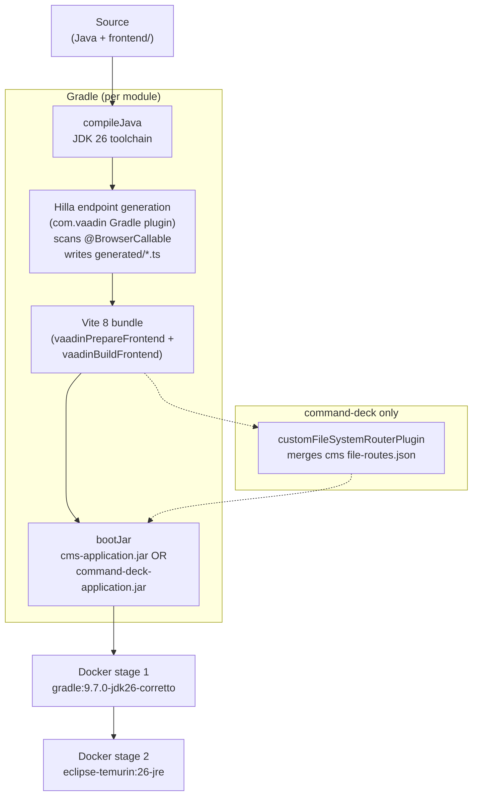

# Gradle build

## Purpose
Document how the Gradle multi-project build wires `:cms` and `:command-deck`, where the Vaadin / Hilla plugin plugs in, and how the optional `lib/*.jar` drivers reach the command-deck classpath. Spring-side configuration sits in [`spring-boot-setup.md`](spring-boot-setup.md); cross-module Java imports are listed in [`shared-code-strategy.md`](shared-code-strategy.md).

## Contents

- [Diagram](#diagram)
- [Narrative](#narrative)
  - [`settings.gradle`](#settingsgradle)
  - [Root `build.gradle`](#root-buildgradle)
  - [`:cms/build.gradle` (cms-specific)](#cmsbuildgradle-cms-specific)
  - [`:command-deck/build.gradle`](#command-deckbuildgradle)
  - [The `drivers` source set](#the-drivers-source-set)
  - [Vaadin Gradle plugin](#vaadin-gradle-plugin)
  - [Local JAR census (`lib/`)](#local-jar-census-lib)
  - [Build outputs](#build-outputs)
  - [`gradle.properties`](#gradleproperties)
- [Where to look in the code](#where-to-look-in-the-code)
- [Open questions](#open-questions)

## Diagram



Source diagram: [`doc/diagrams/src/build-pipeline.mmd`](../diagrams/src/build-pipeline.mmd).

## Narrative

### `settings.gradle`
Two-line module declaration plus plugin pinning:

- `settings.gradle:7` pins `id 'com.vaadin' version "${vaadinVersion}"` (25.2.6 from `gradle.properties:3`).
- `settings.gradle` also applies `org.gradle.toolchains.foojay-resolver-convention` so the JDK 26 toolchain can be provisioned.
- `settings.gradle` includes `cms` and `command-deck`. There is no third module, and [`shared-code-strategy.md`](shared-code-strategy.md) records the decision that there won't be.
- The Vaadin pre-release maven repo is added in `pluginManagement.repositories`.

### Root `build.gradle`
The root build file applies *no* plugins to the root project — it only declares them with `apply false`. Everything happens inside `subprojects { ... }`:

- `apply plugin: 'java'`, `'org.springframework.boot'`, `'io.spring.dependency-management'`, `'com.vaadin'` (lines 16-19). The Spring Boot plugin gives every subproject `bootJar` / `bootRun` tasks and the dependency-management Spring BOM.
- A common dependency block adds:
  - Vaadin: `vaadin-core` + `vaadin-spring-boot-starter`, plus **`hilla-spring-boot-starter` declared explicitly** — Vaadin 25 no longer bundles Hilla in the Vaadin starter, and the React views need it.
  - Spring Boot starters: `security`, `data-jpa`, `validation`, `websocket`, and `spring-boot-starter-aspectj` (renamed from `-aop` in Spring Boot 4). `spring-boot-devtools` and `com.vaadin:vaadin-dev` are `developmentOnly` — `vaadin-dev` is optional as of Vaadin 25 and must be requested.
  - Persistence: H2 (`runtimeOnly`) + PostgreSQL (`runtimeOnly`).
  - Hardware: `com.fazecast:jSerialComm:2.11.4` — used by the relay-switch / load-cell drivers in `:command-deck` but on the classpath of both modules because of the shared block.
  - Office export: `org.apache.poi:poi:5.5.1` + `poi-ooxml:5.5.1` (used by cms result export).
  - Icons: `org.parttio:line-awesome:2.1.0`.
  - Logging: `org.slf4j:slf4j-api` and `ch.qos.logback:logback-classic`, versions from the Spring Boot BOM.
- The Vaadin BOM is imported into `dependencyManagement` (line 51) using `${vaadinVersion}` so all `com.vaadin:*` artefacts align to 25.2.6.
- Java toolchain locked to **JDK 26** (`sourceCompatibility`, `targetCompatibility`, plus `toolchain.languageVersion`).
- `vaadin { productionMode = false; optimizeBundle = false; pnpmEnable = true }` — defaults for dev. The Docker build flips production mode with `-Pvaadin.productionMode=true` (`cms/Dockerfile:5`, `command-deck/Dockerfile:5`). `pnpmEnable` must stay in sync with `vaadin.pnpm.enable=true` in `application.properties`, or dev mode and the Gradle build populate `node_modules` differently. `useGlobalPnpm` stays off — Vaadin fetches its own pinned pnpm. Why `optimizeBundle` is off is unrecorded (OQ-16).

### `:cms/build.gradle` (cms-specific)
Nine lines. Just renames the build outputs:

- `bootJar.archiveBaseName = 'cms-application'` — produces `cms-application.jar` under `cms/build/libs/`.
- `jar.archiveBaseName = 'cms-library'` — Spring Boot's plugin auto-renames the plain jar to `cms-library-plain.jar` once `bootJar` is enabled (verified locally).

No extra dependencies, no extra repositories, no extra plugins.

### `:command-deck/build.gradle`
Two things on top of the root:

1. `implementation project(':cms')` — pulls in the `cms-library-plain.jar` (the plain jar, **not** the Spring Boot fat jar — Spring Boot's Gradle plugin makes `project(':cms')` resolve to the regular jar artefact). This is the only declared cross-module link; everything else flows through Spring component scan at runtime.
2. The conditional [`drivers` source set](#the-drivers-source-set). There is deliberately **no** `fileTree` and no `flatDir` repository: no `src/main` class references a vendor type, so the jars belong to that source set alone.

Output JAR names follow the same pattern: `command-deck-application.jar` (boot) + `command-deck-library-plain.jar` (plain). The CMS Dockerfile assumes the `cms-application.jar` will be the only fat JAR copied; the command-deck Dockerfile makes the same assumption for its image.

### The `drivers` source set

Registered **only when both** `lib/dscusb.jar` and `lib/usbmodbus.jar` exist — real hardware needs both, so per-device gating buys nothing. Sources at `command-deck/src/drivers/java`; compile classpath is the main output plus the main compile classpath (the adapters are `@Component`s and need Spring) plus the two jars. `bootRun` and `bootJar` both get the drivers output **and** the jars, which is what puts the adapter classes in `BOOT-INF/classes` and the vendor jars in `BOOT-INF/lib`.

Two constraints worth keeping:

- **Hook `driversClasses` onto `assemble`, never onto `classes`.** `compileDriversJava` consumes the main output, so `classes.dependsOn driversClasses` creates `classes → driversClasses → compileDriversJava → classes` and Gradle fails with a circular-dependency error. `bootJar` / `bootRun` need no hook at all: a buildable source-set output on their classpath already carries the task dependency.
- **`.gitignore`'s browser-driver rule is anchored** to `/drivers/` (`.gitignore:25`). Unanchored, it matched `command-deck/src/drivers/` too and the adapters never appeared in `git status`.

With the jars absent the block is skipped and a lifecycle line says so; `:command-deck:compileJava` still succeeds. What fails then is *startup* — see [`spring-boot-setup.md`](spring-boot-setup.md#hardware-mode). Design rationale: [`../06-feature-work/virtual-devices/driver-api-extraction.md`](../06-feature-work/virtual-devices/driver-api-extraction.md).

### Vaadin Gradle plugin
Applied to **both** subprojects (root `build.gradle:19`). Gives each module:

- `vaadinPrepareFrontend` — generates `frontend/generated/`, `vite.generated.ts`, the `package.json` `vaadin` block (see the populated `vaadin.dependencies` map in `cms/package.json:69`). Hilla TS clients for `@BrowserCallable` services land here; nothing about this is hand-edited. CLAUDE.md's golden rule: never touch `generated/`.
- `vaadinBuildFrontend` — runs Vite to bundle the React/TS app into static resources that `bootJar` packs under `META-INF/resources/`.
- The `vaadin { productionMode }` switch — production mode bundles eagerly, dev mode delegates to a Vite dev server proxied by Spring.

Crucially, **the plugin runs independently per module**. Each module's `bootJar` contains its own React bundle. The CMS bundle does not see the command-deck routes; the command-deck bundle pulls cms routes in at Vite-plugin level via `command-deck/customFileSystemRouterPlugin.ts`. See [`module-layout.md`](module-layout.md) for the runtime consequence.

#### `vite.config.ts` divergence

- `cms/vite.config.ts` — three-line user config, only adds an alias `cms -> __dirname + '/src/main/frontend'`.
- `command-deck/vite.config.ts` — extends the alias to point one module up (`'../cms/src/main/frontend'`), adds:
  - the `customFileSystemRouterPlugin` (file at `command-deck/customFileSystemRouterPlugin.ts`) which merges `cms/src/main/frontend/generated/file-routes.json` into the deck's own at build start and on dev-time `fs-route-update` HMR events;
  - a `rollupOptions.onwarn` filter that silences Rollup's `MIXED_EXPORTS` warning — likely arising from cross-module imports.

### Local JAR census (`lib/`)
Sole tracked entry: `lib/dscusb.jar` (the USB load-cell driver). `lib/usbmodbus.jar` exists locally but is gitignored at `.gitignore:36`. Neither is on any module's `implementation` configuration; both reach only the [`drivers` source set](#the-drivers-source-set), so a missing jar is a **startup** failure, never a compile failure. Where each comes from and what its build needs: [`../03-backend/driver-jars.md`](../03-backend/driver-jars.md).

The JARs are **not** available to `:cms`, which imports no driver code. Note for anyone tempted to add a `fileTree(dir: 'lib', ...)` to the root `subprojects` block: a *relative* directory there resolves per subproject, to `cms/lib/` and `command-deck/lib/`, neither of which exists — it would look like it grants both modules access and do nothing.

### Build outputs

| Module | Boot JAR | Plain JAR | Where it ends up |
|---|---|---|---|
| `:cms` | `cms-application.jar` | `cms-library-plain.jar` | `cms/build/libs/` → `/app/cms.jar` in container |
| `:command-deck` | `command-deck-application.jar` | `command-deck-library-plain.jar` | `command-deck/build/libs/` → `/app/command-deck.jar` in container |

Both Dockerfiles build with `gradle:9.7.0-jdk26-corretto` and run on `eclipse-temurin:26-jre`. Image structure, the `*.jar` glob caveat and the shared entrypoint are documented in [`../05-ops/docker-images.md`](../05-ops/docker-images.md).

### `gradle.properties`
Single source for plugin and runtime versions:

```
hillaVersion=25.2.6
java.version=26
vaadinVersion=25.2.6
springBootVersion=4.1.0
project.name=breaktest command deck
project.group=ch.rupfizupfi
```

`hillaVersion` is set but **not referenced** by any build file in this checkout (`vaadinVersion` is used everywhere). Likely vestigial from older Hilla 2.x releases that pinned hilla independently of vaadin.

## Where to look in the code
- `settings.gradle:1-17`
- `build.gradle:1-68` (root)
- `cms/build.gradle:1-11`
- `command-deck/build.gradle:1-20`
- `gradle.properties:1-10`
- `cms/Dockerfile:1-31` and `command-deck/Dockerfile:1-30`
- `command-deck/vite.config.ts:1-53` and `command-deck/customFileSystemRouterPlugin.ts:1-144`
- `lib/dscusb.jar` (tracked binary)

To see the resolved dependency graph for either module, run
`./gradlew :command-deck:dependencies --configuration runtimeClasspath`
(or `:cms:...`).

## Open questions

1. **`hillaVersion=25.2.6` in `gradle.properties` is unreferenced.** Nothing in `settings.gradle`, `build.gradle` or either module build script reads it — `com.vaadin:hilla-spring-boot-starter` takes its version from the Vaadin BOM. Drop the line; leaving it invites someone to bump it and expect an effect. (OQ-10)
