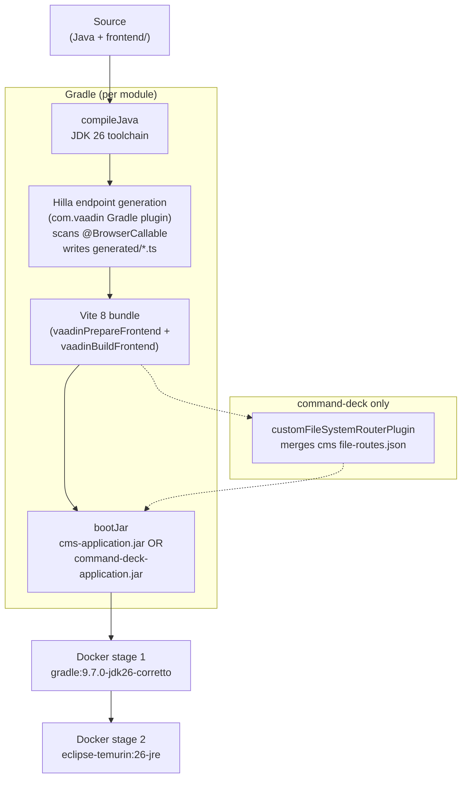

# Gradle build

## Purpose
Document how the Gradle multi-project build wires `:cms` and `:command-deck`, where the Vaadin / Hilla plugin plugs in, and how the `drivers/*.jar` plugins reach the command-deck classpath. Spring-side configuration sits in [`spring-boot-setup.md`](spring-boot-setup.md); cross-module Java imports are listed in [`shared-code-strategy.md`](shared-code-strategy.md).

## Contents

- [Diagram](#diagram)
- [Narrative](#narrative)
  - [`settings.gradle`](#settingsgradle)
  - [Root `build.gradle`](#root-buildgradle)
  - [`:cms/build.gradle` (cms-specific)](#cmsbuildgradle-cms-specific)
  - [`:command-deck/build.gradle`](#command-deckbuildgradle)
  - [Driver plugins: `loader.path`, not the classpath](#driver-plugins-loaderpath-not-the-classpath)
  - [Vaadin Gradle plugin](#vaadin-gradle-plugin)
  - [The driver plugin directory (`drivers/`)](#the-driver-plugin-directory-drivers)
  - [Build outputs](#build-outputs)
  - [`gradle.properties`](#gradleproperties)
- [Continuous integration](#continuous-integration)
- [Where to look in the code](#where-to-look-in-the-code)

## Diagram


```mermaid
flowchart TD
    src["Source<br/>(Java + frontend/)"]

    subgraph gradle_phase["Gradle (per module)"]
        compile["compileJava<br/>JDK 26 toolchain"]
        hilla_gen["Hilla endpoint generation<br/>(com.vaadin Gradle plugin)<br/>scans @BrowserCallable<br/>writes generated/*.ts"]
        vite["Vite 8 bundle<br/>(vaadinPrepareFrontend +<br/>vaadinBuildFrontend)"]
        bootJar["bootJar<br/>cms-application.jar OR<br/>command-deck-application.jar"]
    end

    src --> compile --> hilla_gen --> vite --> bootJar

    subgraph cd_extra["command-deck only"]
        merge["customFileSystemRouterPlugin<br/>merges cms file-routes.json"]
    end
    vite -.-> merge -.-> bootJar

    bootJar --> docker["Docker stage 1<br/>gradle:9.7.0-jdk26-corretto"]
    docker --> runtime["Docker stage 2<br/>eclipse-temurin:26-jre"]
```

Source diagram: [`doc/diagrams/src/build-pipeline.mmd`](../diagrams/src/build-pipeline.mmd).

## Narrative

### `settings.gradle`
Two-line module declaration plus plugin pinning:

- `settings.gradle:7` pins `id 'com.vaadin' version "${vaadinVersion}"` (25.2.6 from `gradle.properties:3`).
- `settings.gradle` also applies `org.gradle.toolchains.foojay-resolver-convention` so the JDK 26 toolchain can be provisioned.
- `settings.gradle` includes `cms` and `command-deck`, and `includeBuild`s `device-api` — a **standalone composite build**, not a third subproject, so [`shared-code-strategy.md`](shared-code-strategy.md)'s no-third-module decision stands. It is standalone so the driver repos can composite-include the contract without configuring the deck's Spring Boot / Vaadin build; it substitutes `ch.rupfizupfi.deck:device-api` wherever that coordinate is depended on.
- The Vaadin pre-release maven repo is added in `pluginManagement.repositories`.

### Root `build.gradle`
The root build file applies *no* plugins to the root project — it only declares them with `apply false`. Everything happens inside `subprojects { ... }`:

- `apply plugin: 'java'`, `'org.springframework.boot'`, `'io.spring.dependency-management'`, `'com.vaadin'` (lines 16-19). The Spring Boot plugin gives every subproject `bootJar` / `bootRun` tasks and the dependency-management Spring BOM.
- A common dependency block adds:
  - Vaadin: `vaadin-core` + `vaadin-spring-boot-starter`, plus **`hilla-spring-boot-starter` declared explicitly** — Vaadin 25 no longer bundles Hilla in the Vaadin starter, and the React views need it.
  - Spring Boot starters: `security`, `data-jpa`, `validation`, `websocket`, and `spring-boot-starter-aspectj` (renamed from `-aop` in Spring Boot 4). `spring-boot-devtools` and `com.vaadin:vaadin-dev` are `developmentOnly` — `vaadin-dev` is optional as of Vaadin 25 and must be requested.
  - Persistence: H2 (`runtimeOnly`) + PostgreSQL (`runtimeOnly`).
  - Hardware: `com.fazecast:jSerialComm:2.11.4` — used by the relay-switch / load-cell drivers in `:command-deck` but on the classpath of both modules because of the shared block.
  - Office export: `org.apache.poi:poi:5.5.1` + `poi-ooxml:5.5.1` (used by cms result export).
  - Icons: `org.parttio:line-awesome:2.1.0`.
  - Logging: `org.slf4j:slf4j-api` and `ch.qos.logback:logback-classic`, versions from the Spring Boot BOM.
- The Vaadin BOM is imported into `dependencyManagement` (line 51) using `${vaadinVersion}` so all `com.vaadin:*` artefacts align to 25.2.6.
- Java toolchain locked to **JDK 26** (`sourceCompatibility`, `targetCompatibility`, plus `toolchain.languageVersion`).
- `vaadin { productionMode = false; optimizeBundle = false; pnpmEnable = true }` — defaults for dev. The Docker build flips production mode with `-Pvaadin.productionMode=true` (`docker/Dockerfile:19`). `pnpmEnable` must stay in sync with `vaadin.pnpm.enable=true` in `application.properties`, or dev mode and the Gradle build populate `node_modules` differently. `useGlobalPnpm` stays off — Vaadin fetches its own pinned pnpm. Why `optimizeBundle` is off is unrecorded (OQ-16).

### `:cms/build.gradle` (cms-specific)
Nine lines. Just renames the build outputs:

- `bootJar.archiveBaseName = 'cms-application'` — produces `cms-application.jar` under `cms/build/libs/`.
- `jar.archiveBaseName = 'cms-library'` — Spring Boot's plugin auto-renames the plain jar to `cms-library-plain.jar` once `bootJar` is enabled (verified locally).

No extra dependencies, no extra repositories, no extra plugins.

### `:command-deck/build.gradle`
Two things on top of the root:

1. `implementation project(':cms')` — pulls in the `cms-library-plain.jar` (the plain jar, **not** the Spring Boot fat jar — Spring Boot's Gradle plugin makes `project(':cms')` resolve to the regular jar artefact). This is the only declared cross-module link; everything else flows through Spring component scan at runtime.
2. `implementation 'ch.rupfizupfi.deck:device-api:1.0.0'` — resolved by the `device-api` included build, never from a repository.
3. The [driver plugin](#driver-plugins-loaderpath-not-the-classpath) wiring: a `developmentOnly` edge onto `drivers/` and the `driverPluginTest` task. No configuration puts a driver on `bootJar`, and nothing resolves one from a repository.
4. An explicit `dependsOn` from the Vaadin/Hilla tasks onto the included build's `:jar`: the Vaadin plugin queries the runtime classpath mid-execution without declaring the dependency, so a standalone `hillaGenerate` (what `script/typecheck.ps1` runs) fails without it.

Output JAR names follow the same pattern: `command-deck-application.jar` (boot) + `command-deck-library-plain.jar` (plain). The CMS Dockerfile assumes the `cms-application.jar` will be the only fat JAR copied; the command-deck Dockerfile makes the same assumption for its image.

### Driver plugins: `loader.path`, not the classpath

**No build produces a boot jar containing a driver.** `bootJar` sets `Main-Class` to `org.springframework.boot.loader.launch.PropertiesLauncher` (Boot 4 moved the launcher into `…loader.launch`; the pre-3.2 name fails with `ClassNotFoundException`), which extends the classpath at launch with the directories named by `loader.path` / `LOADER_PATH`. A jar present there is loaded, a jar absent is not, and absence stays a *startup* failure named by `HardwareModeCheck` — the fix is to put the jar in place and restart, never to rebuild. That is also what keeps the licence-restricted `usbmodbus.jar` out of every image and out of git.

Each jar is a self-contained deck plugin, built in its own sibling repo: it implements `ch.rupfizupfi.deck:device-api` (composite-included from `device-api/` here, so **the driver repo's compile is the contract-conformance check**) and ships a Spring Boot auto-configuration registered via `META-INF/spring/...AutoConfiguration.imports` — required because the driver packages sit outside the deck's `ch.rupfizupfi.deck` component-scan root. `PropertiesLauncher` puts `loader.path` jars in the same classloader as the app, so those imports files are found exactly as a nested `BOOT-INF/lib` jar's would be. Nothing in this repo names a driver class.

Two build-side pieces, and that is all — there is **no repository, no credential
and no staging task** anywhere in the driver path any more. Delivering the public
`dscusb` plugin into the deck image needed all three, and the deck container turned
out not to want a driver: it is the simulation and test deployment, on Linux, where
both Windows-only drivers refuse to register. The bench, which does want
drivers, has always taken them from `drivers/` by hand. So `stageDrivers`, its
`StageDriverPlugins` task class, the `driverPlugins`/`deckDriver` configuration pair
and the content-filtered GitHub Packages repository are all gone:

| Piece | Does what |
|---|---|
| `developmentOnly fileTree('drivers')` | Puts `drivers/*.jar` on **`bootRun`'s** classpath. Unconditional, because `developmentOnly` is what the Spring Boot plugin excludes from `bootJar` — so no build can pack a driver — and because an empty or absent directory contributes nothing. There is no build flag: both driver auto-configurations are `@ConditionalOnProperty(deck.hardware.mode=real)`, mirroring the simulated pair, so `deck.hardware.mode` is the only switch and a second build-time one could only disagree with it. |
| `driverPluginTest` | Verification task over the jars actually in `drivers/`: each must call `DeviceApi.verifyPluginBuiltAgainst`, satisfy the current contract and register a `device-api` provider, and with both present the real context boots at `deck.hardware.mode=real` and the vendor providers must displace the simulators. Its classpath is the test runtime classpath **plus** those jars — the app first, the same precedence `loader.path` gives them — so `test` stays hermetic and a dropped-in jar never changes what the ordinary suite runs. Tagged `driver-plugin`, which `test` excludes. |

Design rationale and history: [`../06-feature-work/virtual-devices/driver-api-extraction.md`](../06-feature-work/virtual-devices/driver-api-extraction.md); what fails at startup without the jars: [`spring-boot-setup.md`](spring-boot-setup.md#hardware-mode); why no container carries one: [`../05-ops/docker-and-profiles.md`](../05-ops/docker-and-profiles.md).

### Vaadin Gradle plugin
Applied to **both** subprojects (root `build.gradle:19`). Gives each module:

- `vaadinPrepareFrontend` — generates `frontend/generated/`, `vite.generated.ts`, the `package.json` `vaadin` block (see the populated `vaadin.dependencies` map in `cms/package.json:69`). Hilla TS clients for `@BrowserCallable` services land here; nothing about this is hand-edited. Never touch `generated/`.
- `vaadinBuildFrontend` — runs Vite to bundle the React/TS app into static resources that `bootJar` packs under `META-INF/resources/`.
- The `vaadin { productionMode }` switch — production mode bundles eagerly, dev mode delegates to a Vite dev server proxied by Spring.

Crucially, **the plugin runs independently per module**. Each module's `bootJar` contains its own React bundle. The CMS bundle does not see the command-deck routes; the command-deck bundle pulls cms routes in at Vite-plugin level via `command-deck/customFileSystemRouterPlugin.ts`. See [`module-layout.md`](module-layout.md) for the runtime consequence.

#### `vite.config.ts` divergence

- `cms/vite.config.ts` — three-line user config, only adds an alias `cms -> __dirname + '/src/main/frontend'`.
- `command-deck/vite.config.ts` — extends the alias to point one module up (`'../cms/src/main/frontend'`), adds:
  - the `customFileSystemRouterPlugin` (file at `command-deck/customFileSystemRouterPlugin.ts`) which merges the cms `file-routes.json` into the deck's own at build start and on dev-time `fs-route-update` HMR events. It derives the cms path from the deck's by swapping the module segment, and the deck's own from the Vite config: `frontend/generated/` in dev mode, the build `outDir` in production (`command-deck/customFileSystemRouterPlugin.ts:114`). Neither copy is in git — `generated/` is untracked — so both exist only after a build has run;
  - a `rollupOptions.onwarn` filter that silences Rollup's `MIXED_EXPORTS` warning — likely arising from cross-module imports.

### The driver plugin directory (`drivers/`)
**One plugin directory per machine, and everything reads it**: `bootRun` through `developmentOnly`, `driverPluginTest` through its own classpath, and `script/run-bench.ps1` through `LOADER_PATH`. That is the point of the name — the mechanism differs between a Gradle-launched classpath and a `PropertiesLauncher` one, but the file location a person has to know does not.

**No jar in it is tracked** — `.gitignore` excludes `/drivers/*.jar` and the directory's `README.md` is committed. A tracked copy would silently diverge from the sibling repo it is built from. Where each jar comes from and what its build needs: [`../03-backend/driver-jars.md`](../03-backend/driver-jars.md).

The JARs are **not** available to `:cms`, which imports no driver code. Note for anyone tempted to add a `fileTree(dir: 'drivers', ...)` to the root `subprojects` block: a *relative* directory there resolves per subproject, to `cms/drivers/` and `command-deck/drivers/`, neither of which exists — it would look like it grants both modules access and do nothing. `:command-deck` anchors its own on `rootProject.projectDir` for exactly that reason.

### Build outputs

| Module | Boot JAR | Plain JAR | Where it ends up |
|---|---|---|---|
| `:cms` | `cms-application.jar` | `cms-library-plain.jar` | `cms/build/libs/` → `/app/cms.jar` in container |
| `:command-deck` | `command-deck-application.jar` | `command-deck-library-plain.jar` | `command-deck/build/libs/` → `/app/command-deck.jar` in container |

Both Dockerfiles build with `gradle:9.7.0-jdk26-corretto` and run on `eclipse-temurin:26-jre`. Image structure, the `*.jar` glob caveat and the shared entrypoint are documented in [`../05-ops/docker-images.md`](../05-ops/docker-images.md).

### `gradle.properties`
Single source for plugin and runtime versions:

```
java.version=26
vaadinVersion=25.2.6
springBootVersion=4.1.0
project.name=breaktest command deck
project.group=ch.rupfizupfi
```

`vaadinVersion` is the only Vaadin-side pin: `hilla-spring-boot-starter` takes its version from the Vaadin BOM, so there is nothing to bump separately. A `hillaVersion` property used to sit here, read by nothing — bumping it had no effect, which is why it is gone.

## Continuous integration

Two workflows, both on pull requests and pushes to `main`:

| Workflow | Runs | Publishes |
|---|---|---|
| [`build.yml`](../../.github/workflows/build.yml) | `pnpm test` in both modules (Vitest, node env), `./gradlew build -Pvaadin.productionMode=true` (the JVM unit suites run inside `build`), then [`script/typecheck.ps1`](../../script/typecheck.ps1) under ubuntu's pwsh | nothing |
| [`device-api.yml`](../../.github/workflows/device-api.yml) | `./gradlew -p device-api build` | the contract, when its version changed |

Three things `build.yml` depends on:

- **No credentials.** Nothing in this build resolves from a private repository — not the Gradle build, not the image build. A driver is a launch-time plugin supplied by hand on the bench, so its absence cannot fail a build. `driverPluginTest` is deliberately not in CI: a Linux runner with no vendor jars can only report a skip.
- **`pnpm install --frozen-lockfile` in each module**, so the gate can resolve `tsc`. It runs before Gradle: `build` in dev mode does not pull `vaadinPrepareFrontend` into the task graph, but a production-mode build would — and that task installs with npm and deletes `pnpm-lock.yaml`, which `--frozen-lockfile` afterwards could not survive (the same hazard `script/typecheck.ps1` steps around).
- **The regenerated Hilla client is not diffed against what is committed.** It does not come back byte-identical — `generated-file-list.txt` reorders nondeterministically — so a drift check would fail on noise.

The driver repos run the mirror image: each composite-includes `device-api/` from a sibling checkout of this repo pinned to `main`, making their compile the contract-conformance check. `dscusb` publishes on a version bump; `usbmodbus` builds only, since its shadow jar bundles vendor jars that may not be redistributed.

## Where to look in the code
- `settings.gradle:1-21`
- `build.gradle:1-73` (root)
- `cms/build.gradle:1-11`
- `command-deck/build.gradle:1-118`
- `device-api/settings.gradle:1-9` and `device-api/build.gradle:1-40` (the included build)
- `gradle.properties:1-10`
- `docker/Dockerfile:1-51` (one file for both images, `MODULE` build arg)
- `command-deck/vite.config.ts:1-53` and `command-deck/customFileSystemRouterPlugin.ts:1-144`
- `drivers/README.md` (the directory's only tracked file — see [The driver plugin directory](#the-driver-plugin-directory-drivers))
- `command-deck/src/test/java/ch/rupfizupfi/deck/device/DriverPlugins.java` and `DriverPluginContractTest` / `DriverPluginBootTest` (what `driverPluginTest` runs)

To see the resolved dependency graph for either module, run
`./gradlew :command-deck:dependencies --configuration runtimeClasspath`
(or `:cms:...`).
