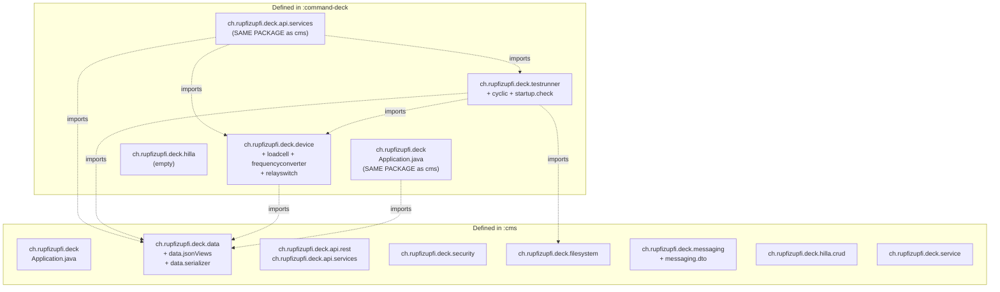

# Shared code strategy

## Purpose
Catalogue exactly which `ch.rupfizupfi.deck.*` sub-packages live in `:cms`, which live in `:command-deck`, and which Java symbols cross the boundary. Mechanism (Gradle `project(':cms')` + Spring component scan) is explained in [`gradle-build.md`](gradle-build.md) and [`spring-boot-setup.md`](spring-boot-setup.md); this document is the **map**.

## Contents

- [Diagram](#diagram)
- [Narrative](#narrative)
  - [Dependency direction](#dependency-direction)
  - [Sub-packages by owner](#sub-packages-by-owner)
  - [Cross-module Java imports (deck → cms)](#cross-module-java-imports-deck--cms)
  - [How a deck `@Service` gets a cms bean](#how-a-deck-service-gets-a-cms-bean)
  - [What is **not** shared](#what-is-not-shared)
  - [Bean pickup summary](#bean-pickup-summary)
- [Where to look in the code](#where-to-look-in-the-code)
- [Decision: cms stays the shared base (2026-08-16)](#decision-cms-stays-the-shared-base-2026-08-16)
- [Open questions](#open-questions)

## Diagram

Source diagram: [`doc/diagrams/src/package-overlap.mmd`](../diagrams/src/package-overlap.mmd).

## Narrative

### Dependency direction
There is exactly one declared cross-module link: `command-deck/build.gradle:2` — `implementation project(':cms')`. cms does **not** depend on command-deck, and a repo-wide grep for `import ch.rupfizupfi.deck.testrunner` or `import ch.rupfizupfi.deck.device` from inside `cms/` returns zero hits. The arrow points one way.

### Sub-packages by owner
| Sub-package | Owner | Notes |
|---|---|---|
| `ch.rupfizupfi.deck` | both | both `Application.java` classes live here |
| `ch.rupfizupfi.deck.api.rest` | cms | 3 `@RestController`s |
| `ch.rupfizupfi.deck.api.services` | both | cms hosts 11 `@BrowserCallable`s, deck hosts 3 (`SuckService`, `TestRunnerService`, `DeviceInfoService`) |
| `ch.rupfizupfi.deck.data` (+ `.jsonViews`, `.serializer`) | cms | 10 `@Entity` classes, all `JpaRepository`s |
| `ch.rupfizupfi.deck.security` | cms | `SecurityConfiguration`, `AuthenticatedUser`, `UserUtils`, `UserDetailsServiceImpl`, the AOP aspect |
| `ch.rupfizupfi.deck.messaging` (+ `.dto`) | cms | `WebSocketConfig` + STOMP DTOs |
| `ch.rupfizupfi.deck.filesystem` | cms | `StorageLocationService`, `CSVStoreService` |
| `ch.rupfizupfi.deck.hilla.crud` | cms | `OwnerDataHelper` + Hilla CRUD plumbing |
| `ch.rupfizupfi.deck.service` | cms | `FileService` |
| `ch.rupfizupfi.deck.hilla` | deck | empty placeholder directory (`command-deck/src/main/java/ch/rupfizupfi/deck/hilla/`) |
| `ch.rupfizupfi.deck.device` (+ `.loadcell`, `.frequencyconverter`, `.relayswitch`) | deck | hardware drivers + `DeviceService` |
| `ch.rupfizupfi.deck.testrunner` (+ `.cyclic`, `.startup.check`) | deck | test-execution engine |

Two packages are present in **both** module source trees: `ch.rupfizupfi.deck` and `ch.rupfizupfi.deck.api.services`. Because the FQNs of the classes inside them are unique (`Application` is in both modules but compiled into different JARs that are loaded one at a time per app; the `api/services` classes are disjoint), this is legal but worth being aware of when grepping.

### Cross-module Java imports (deck → cms)
A grep across `command-deck/src/main/java` for `^import ch\.rupfizupfi\.deck\.` returned 49 hits across 19 files. The packages consumed from cms are:

| cms package | Symbols imported by deck | Used in deck classes |
|---|---|---|
| `ch.rupfizupfi.deck.data` | `User`, `UserRepository`, `TestResult`, `TestResultRepository`, `Setting`, `SettingRepository` | `Application`, `AbstractTest`, `DestructiveTest`, `CyclicTest`, `TimeCyclicTest`, `TestRunnerThread`, `TestRunnerFactory`, `LoadCellThread`, `TestLogger`, `TestRunnerService`, `DeviceService` |
| `ch.rupfizupfi.deck.filesystem` | `StorageLocationService`, `CSVStoreService` | `TestRunnerFactory`, `LoadCellThread`, `TestLogger`, `FileSystemCheck` |

Other cms packages (`security`, `messaging`, `hilla.crud`, `api.rest`, `service`) are **not** statically imported by deck code — but they are still consumed at runtime via Spring autowiring and via Hilla's runtime endpoint registry (the `vaadin.allowed-packages` setting in `application.properties:15` ensures Vaadin discovers cms `@BrowserCallable`s in the deck app).

### How a deck `@Service` gets a cms bean
Example: `command-deck/.../device/DeviceService.java:3` imports `ch.rupfizupfi.deck.data.SettingRepository`. At deck-app startup:

1. Gradle has compiled `cms-library-plain.jar` and put it on the deck classpath.
2. Spring's `@SpringBootApplication` on `command-deck/.../Application.java` triggers component scan from `ch.rupfizupfi.deck` and finds `SettingRepository` (annotated `@Service`) inside the cms jar.
3. `SettingRepository` instance is registered in the deck `ApplicationContext`.
4. `DeviceService` (annotated `@Service` in deck jar) is also instantiated; its constructor / field-injection receives the cms-side `SettingRepository`.

The same pattern applies to `StorageLocationService` ⇒ `LoadCellThread`, `CSVStoreService` ⇒ `TestLogger`, etc.

### What is **not** shared
- The two `Application.java` classes — these are compile-time disjoint (each module's JAR contains its own `Application` class). At runtime only one is the bootstrap class. They do not collide because the deck app is launched via `command-deck-application.jar`'s Boot manifest, which names *its* `Application` as `Start-Class`.
- Test runners (`testrunner/*`) and device drivers (`device/*`) are deck-only. cms code does not (and should not) import them.
- Frontend code: each module has its own `src/main/frontend/` tree, its own `package.json`, its own Vaadin `generated/` directory, its own `vite.config.ts`. The deck Vite config aliases `'cms'` to `'../cms/src/main/frontend'` (`command-deck/vite.config.ts:30`) so deck TS code can import `useAuth` from the aliased module specifier `cms/util/auth.js` (see `command-deck/src/main/frontend/views/@layout.tsx:5`), but no symbol is duplicated. The deck's `customFileSystemRouterPlugin` merges cms file-routes at build time (`command-deck/customFileSystemRouterPlugin.ts:73`). Frontend strategy details belong to [`../04-frontend/frontend-module-split.md`](../04-frontend/frontend-module-split.md); from a build-system standpoint each module ships its own React bundle.
- `cms/src/main/resources/data.sql` is in the cms classpath only — but that classpath is also the deck's, via the `cms-library` jar, so a deck-only boot against an empty database does seed. Mechanics in [`spring-boot-setup.md`](spring-boot-setup.md).

### Bean pickup summary
When `:command-deck:bootRun` boots, the following bean categories from cms are picked up automatically (no explicit annotations on the deck side):

- All 10 JPA `@Entity` classes (auto-detected via `EntityScan` default).
- All `JpaRepository` interfaces in `cms/.../data/` (`UserRepository`, `TestResultRepository`, etc.) — discovered by Spring Data JPA's repository scan rooted at `ch.rupfizupfi.deck`.
- `SecurityConfiguration` — the deck app inherits CMS's `VaadinWebSecurity` setup, including the `/api/**` permitAll, the `/login` view and the BCrypt password encoder.
- `WebSocketConfig` — STOMP `/topic` broker + `/status`, `/logs` endpoints.
- `CheckUserCanOnlyAccessOwnDataAspect` — applies to every `DataWithOwner` access from deck-side `testrunner` code as well.
- All cms `@BrowserCallable` services. So the deck Hilla bundle exposes the **union** of cms (11) + deck (3) = 14 services. Browser-side, the deck React bundle imports cms TS clients via the `'cms'` alias.

## Where to look in the code
- `command-deck/build.gradle:2` — the only declared cross-module dependency.
- `command-deck/src/main/java/ch/rupfizupfi/deck/Application.java:1-42` — entry point; package is identical to cms's.
- `command-deck/src/main/java/ch/rupfizupfi/deck/device/DeviceService.java:3` — concrete example of a deck `@Service` autowiring `cms/data/SettingRepository`.
- `command-deck/src/main/java/ch/rupfizupfi/deck/api/services/TestRunnerService.java:3-6` — deck Hilla service consuming cms `TestResult` / `TestResultRepository`.
- `command-deck/src/main/java/ch/rupfizupfi/deck/testrunner/TestRunnerFactory.java:3-8` — peak cross-module fan-in (cms `TestResult` + cms `CSVStoreService` + cms `StorageLocationService` + own `device/loadcell` + own `testrunner/startup/check`).
- `command-deck/src/main/frontend/views/@layout.tsx:5` — frontend cross-import via the `cms` Vite alias.
- `command-deck/src/main/java/ch/rupfizupfi/deck/hilla/` — empty deck-only package (placeholder).
- `cms/src/main/java/ch/rupfizupfi/deck/security/CheckUserCanOnlyAccessOwnDataAspect.java` — the AOP advice that fires for both modules.

## Decision: cms stays the shared base (2026-08-16)

A `:shared` module hosting entities, repositories, security, filesystem
and Hilla CRUD plumbing was considered and **declined**. `:command-deck`
continues to depend on `:cms` directly, and being a runtime superset of
cms is the accepted shape rather than a smell to fix — deck genuinely is
"cms plus hardware control", and the deployment split (cloud cms, on-machine
deck) doesn't change what code each needs.

Consequences to keep in mind:

- Every cms bean, entity and `@BrowserCallable` service exists in the
  deck app. Access control is the role annotations, not the packaging.
- Anything genuinely shared belongs in `:cms` even if cms itself never
  calls it. That is a slightly odd home, and the reason is this decision.
- `cms-library.jar` (the plain `jar` task output) exists solely so
  `project(':cms')` can be consumed by `:command-deck`. No external
  consumer is known.

## Open questions

1. **Delete the empty `command-deck/.../hilla/` package.**
   `command-deck/src/main/java/ch/rupfizupfi/deck/hilla/` exists on disk and
   contains nothing — no classes, no subdirectories. The name shadows cms's real
   `ch.rupfizupfi.deck.hilla.crud` package, so a reader grepping for the Hilla
   CRUD plumbing can land on the wrong module. Nothing was ever planned here;
   remove the directory. (OQ-13)
