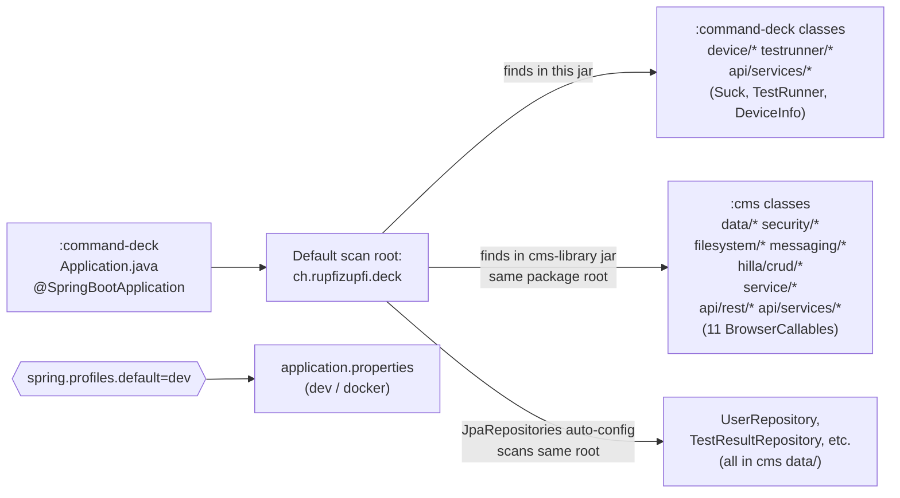

# Spring Boot setup

## Purpose
Document how each module boots, which Spring profiles exist, and — crucially — how Spring's default component scan stitches `cms` beans into `command-deck` without any explicit `@ComponentScan` / `@EntityScan` / `@EnableJpaRepositories` annotations. Build-time wiring sits in [`gradle-build.md`](gradle-build.md); the cross-module Java-import inventory is in [`shared-code-strategy.md`](shared-code-strategy.md).

## Contents

- [Diagram](#diagram)
- [Narrative](#narrative)
  - [Entry points](#entry-points)
  - [Component scan: how `cms` beans reach `command-deck`](#component-scan-how-cms-beans-reach-command-deck)
  - [`@RestController` paths](#restcontroller-paths)
  - [Profiles](#profiles)
  - [Other shared `application.properties` keys](#other-shared-applicationproperties-keys)
  - [Hardware mode](#hardware-mode)
  - [Startup sequence (text, not a sequence diagram)](#startup-sequence-text-not-a-sequence-diagram)
  - [Docker startup](#docker-startup)
- [Where to look in the code](#where-to-look-in-the-code)
- [Open questions](#open-questions)

## Diagram



## Narrative

### Entry points
Both modules have a near-identical `Application.java`:

- `cms/src/main/java/ch/rupfizupfi/deck/Application.java` — `@SpringBootApplication @Theme("breaktest-command-deck")` + `@ColorScheme(DARK)`, implements `AppShellConfigurator`. Defines an `ApplicationDataSourceScriptDatabaseInitializer` bean that gates `data.sql` execution on `UserRepository.count() == 0`. `UserRepository` is `@Lazy` here.
- `command-deck/src/main/java/ch/rupfizupfi/deck/Application.java` — same annotations, same theme, same initializer bean, but `UserRepository` is **not** `@Lazy`.

The cms-side `@Lazy` is there to break a startup cycle. The deck copy does not
need it, because in a deck boot the deck class is the one actually loaded (see
below) and the cycle does not form. The divergence is deliberate, and it is live
input to OQ-5 below — whatever cycle the `@Lazy` defuses is probably the same one
`spring.main.allow-circular-references=true` is covering for.

Both also carry `@EnableConfigurationProperties(SqlInitializationProperties.class)`: Spring Boot 4's `DataSourceInitializationAutoConfiguration` backs off once an `ApplicationScriptDatabaseInitializer` is user-declared, and registering the properties keeps them injectable.

#### The two classes have the same fully-qualified name

Both are `ch.rupfizupfi.deck.Application`. In a `:command-deck` boot, the deck copy sits in `BOOT-INF/classes` and the cms copy inside `BOOT-INF/lib/cms-library.jar`, and the classloader resolves `BOOT-INF/classes` first — so **the cms class is never loaded and only one initializer bean exists.** There is no duplicate-bean problem to fix, and the `@Lazy` divergence has no effect on a deck boot; it only applies when `:cms` runs as its own app.

`:command-deck` ships no `data.sql` of its own, but the cms one is on its classpath via the `cms-library` jar, so `classpath:data.sql` resolves and a deck-only boot against an empty database seeds normally.

> This is worth knowing before touching either file: editing `cms/src/main/java/ch/rupfizupfi/deck/Application.java` changes nothing about how the deck app behaves, and adding a bean to the deck copy silently shadows anything the cms copy declares. It is not a pattern to extend — a config class with a distinct name per module would be less surprising.

Neither class uses `scanBasePackages`, `@EntityScan`, `@EnableJpaRepositories` or `@ComponentScan`. A repo-wide grep confirms there are zero such annotations anywhere in production code.

### Component scan: how `cms` beans reach `command-deck`
`@SpringBootApplication` is a meta-annotation that bundles `@Configuration` + `@EnableAutoConfiguration` + `@ComponentScan`, and `@ComponentScan` defaults to *the package of the annotated class*. Both `Application` classes live in `ch.rupfizupfi.deck`. Therefore each Spring context scans the same package:

```
ch.rupfizupfi.deck.**
```

Spring does not care which JAR a class lives in — it scans the classpath. When `:command-deck:bootRun` starts:

1. `command-deck-application.jar` is on the classpath (via Boot's nested-jar layout).
2. `cms-library-plain.jar` is **also** on the classpath because of `implementation project(':cms')`.
3. Both contain classes under `ch.rupfizupfi.deck.*`.
4. Spring discovers and instantiates every `@Component`, `@Service`, `@Configuration`, `@Aspect`, `@RestController` and `@BrowserCallable` from both modules.

That is why:

- `SecurityConfiguration` (cms) protects the deck app's HTTP routes.
- `WebSocketConfig` (cms) registers `/status` and `/logs` STOMP endpoints in the deck context.
- `CheckUserCanOnlyAccessOwnDataAspect` (cms) intercepts every `DataWithOwner` JPA call from deck-side `testrunner/*` code.
- `AuthenticatedUser`, `UserUtils`, `OwnerDataHelper`, `StorageLocationService`, `CSVStoreService`, `FileService`, `UserDetailsServiceImpl` and the Hilla `CrudRepositoryService<...>` machinery are all autowired into deck services without any extra wiring.
- All 11 cms `@BrowserCallable` services are exposed by the deck app's Hilla endpoint dispatcher in addition to the deck's own 3 — meaning the deck `command-deck-application.jar` exposes **14** browser-callable services.

`@EnableJpaRepositories` and `@EntityScan` follow the same default — `EntityManagerFactoryBuilder` auto-configuration scans from the `@SpringBootApplication` package outward, so `data/User`, `data/TestResult`, ... and `UserRepository`, `TestResultRepository`, ... (all interfaces extending `JpaRepository`) are picked up in both contexts without further annotation.

### `@RestController` paths
The three controllers (`ControllerEndpoint`, `DownloadResults`, `FileEndpoint`) live in `cms/.../api/rest/`. Both apps register them. `application.properties` line 16 sets `vaadin.exclude-urls=/api/**`, which tells the Vaadin servlet not to claim `/api/*` URLs so MVC controllers can serve them. The full `@RequestMapping` path list is in [`../03-backend/hilla-services.md`](../03-backend/hilla-services.md).

### Profiles
There are exactly two profiles, each with byte-identical files between modules.

| Profile | DB | Port | TLS | Flags |
|---|---|---|---|---|
| `dev` (default via `spring.profiles.default=dev`) | H2 file at `./.data/deck` | `${PORT:8080}` | no | `spring.h2.console.enabled=true`, `ddl-auto=update`, `spring.sql.init.mode=always`, `vaadin.devmode.devTools.enabled=true`, `logging.level.web=DEBUG` |
| `docker` | PostgreSQL `jdbc:postgresql://db:5432/rupfizupfi` (user `rupfizupfi`, pwd `${DB_PASSWORD}`) | `${PORT:443}` | yes (PKCS12 `/home/appuser/keystore/rupfizupfi.p12`) | `ddl-auto=update`, `ImprovedNamingStrategy`, `defer-datasource-initialization` |

The shared-by-default `application.properties` (line 1: `spring.profiles.default=dev`) selects `dev` whenever `SPRING_PROFILES_ACTIVE` is unset; the docker compose file sets `SPRING_PROFILES_ACTIVE=docker` for both server services.

The dev-profile H2 URL is `jdbc:h2:file:./.data/deck` — **identical** across modules, so running both `:cms:bootRun` and `:command-deck:bootRun` simultaneously on the same checkout will fight over the same file. Practically, one app at a time is run in dev. (`:command-deck:bootRun` already serves the cms UI routes thanks to the route merge plugin, so there is rarely a reason to run both.)

### Other shared `application.properties` keys
Both modules' base `application.properties` files (lines 1-18) are byte-identical:

- `spring.profiles.default=dev`
- `spring.main.allow-circular-references=true` — circular bean dependency tolerance, hints at a known cyclic graph somewhere; should be hunted down (OQ-5).
- `vaadin.allowed-packages=com.vaadin,org.vaadin,dev.hilla,ch.rupfizupfi.deck` — restricts Vaadin's frontend asset scan to these roots.
- `vaadin.exclude-urls=/api/**`
- `vaadin.devmode.devTools.enabled=false` (the dev profile re-enables it).
- `vaadin.launch-browser=true`
- `vaadin.analytics.enabled=false`
- `spring.devtools.restart.additional-exclude` is set to the value `dev/hilla/openapi.json` — workaround per inline comment for hilla #842.
- `deck.hardware.mode=real` — see below. Present in **both** modules' files to keep them byte-identical; only `:command-deck` reads it.

### Hardware mode

`deck.hardware.mode` (`real` | `simulated`, base default `real`) selects how the deck reaches the machine, and `HardwareModeCheck` enforces it. The `dev` profile sets `simulated`; `docker` sets `real` explicitly and is **refused** if anything overrides it to `simulated`. The property is legal on any profile — only `docker` restricts its value.

Because `spring.profiles.default=dev`, an unset `SPRING_PROFILES_ACTIVE` now resolves to the *safe* state rather than to one that talks to hardware.

Three properties of the check matter:

- **It is a `BeanFactoryPostProcessor`, not an ordinary bean.** It therefore runs after the bean definitions are known but *before any singleton is instantiated*, which is what lets it report "`lib/usbmodbus.jar` is missing" instead of letting `DeviceService`'s constructor fail with a `NoSuchBeanDefinitionException` naming an interface. It also matches bean types with `allowEagerInit=false`, so the check itself never opens a USB device.
- **It refuses `simulated` under the `docker` profile before the datasource is touched.** That profile is the on-machine deployment; simulated hardware must never reach the bench, and refusing at BFPP time means the refusal does not depend on a reachable Postgres.
- **It stands down when `spring.aot.processing` is set.** `hillaGenerate` boots a Spring AOT context purely to discover `@BrowserCallable` classes; without the exemption that context refuses to start and the *build* starts depending on the vendor jars, defeating the optional [`drivers` source set](gradle-build.md#the-drivers-source-set).

There is no fallback in either direction. Rationale: [`../06-feature-work/virtual-devices/driver-api-extraction.md`](../06-feature-work/virtual-devices/driver-api-extraction.md#startup-contract).

### Startup sequence (text, not a sequence diagram)
1. `gradle :MODULE:bootRun` → JVM starts `Application.main`.
2. Spring loads `application.properties`, then `application-dev.properties` (or `-docker`), populating `Environment`.
   In `:command-deck`, `HardwareModeCheck` runs here — before any bean is created — and aborts the boot if the selected `deck.hardware.mode` cannot be served.
3. Hibernate boots, `ddl-auto=update` reconciles the schema, then `defer-datasource-initialization=true` defers `data.sql` execution to **after** entity-manager init (so JPA tables exist before the seed runs).
4. The custom `SqlDataSourceScriptDatabaseInitializer` bean checks `UserRepository.count() == 0`. Empty DB → seeds from `data.sql`. Non-empty → no-op.
5. Vaadin scans `vaadin.allowed-packages` for `@Route`, `@BrowserCallable`, `AppShellConfigurator`, etc., and exposes the React bundle at the servlet root.
6. `WebSocketConfig` registers `/status` and `/logs` STOMP endpoints.
7. `SecurityConfiguration`'s `SecurityFilterChain` bean registers the HTTP filters (Vaadin 25 removed `VaadinWebSecurity`; the defaults now come from `VaadinSecurityConfigurer`). `/api/**` is `permitAll()` — see [`../03-backend/security-and-tenancy.md`](../03-backend/security-and-tenancy.md).
8. Application is ready to serve.

In the `:command-deck` deployment, an additional autowired `DeviceService` builds the load cell and frequency converter from their injected providers. (Detail belongs to `03-backend/hardware-integration.md`, out of scope here.)

### Docker startup
Both images share one entrypoint that unwraps the DB-password secret and
self-signs a TLS keystore before `exec java -jar`, with
`SPRING_PROFILES_ACTIVE=docker` already set by compose. Details:
[`../05-ops/docker-images.md`](../05-ops/docker-images.md).

## Where to look in the code
- `cms/src/main/java/ch/rupfizupfi/deck/Application.java:22-43`
- `command-deck/src/main/java/ch/rupfizupfi/deck/Application.java:21-42`
- `cms/src/main/java/ch/rupfizupfi/deck/security/SecurityConfiguration.java:16-45`
- `cms/src/main/java/ch/rupfizupfi/deck/messaging/WebSocketConfig.java:9-24`
- `cms/src/main/resources/application.properties:1-18`, `application-dev.properties:1-15`, `application-docker.properties:1-16`
- `command-deck/src/main/resources/application*.properties` — byte-identical to cms's.
- `cms/src/main/resources/data.sql` — single seed file in the repo.
- `cms/src/docker/bin/startup.sh` — used by both Docker images.
- Profile table, expanded with deployment context: [`../05-ops/docker-and-profiles.md`](../05-ops/docker-and-profiles.md) and [`../05-ops/db.md`](../05-ops/db.md).
- Annotation-by-annotation breakdowns: `@BrowserCallable` and `@RestController` in [`../03-backend/hilla-services.md`](../03-backend/hilla-services.md), `@Entity` in [`../03-backend/persistence-model.md`](../03-backend/persistence-model.md), `@Configuration` / `@Aspect` in [`../03-backend/security-and-tenancy.md`](../03-backend/security-and-tenancy.md).

## Open questions

1. **`spring.main.allow-circular-references=true` papers over an unidentified cycle.** Set in both modules' `application.properties`. The cms-side `@Lazy UserRepository` was added to break a startup cycle, so the two are probably the same knot — but nobody has confirmed which beans are involved. Removing the flag and reading the failure is the cheapest way to find out. (OQ-5)
