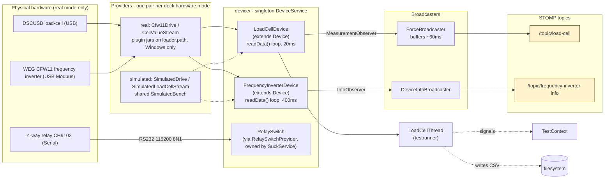

> Branch: `dev-split` — captured 2026-08-17.

# Hardware integration

## Purpose

Document the path from a physical sensor or actuator to a STOMP frame in the browser:
which port carries the bytes, which provider speaks the protocol, which class wraps it,
which thread polls it, which broadcaster publishes it. All hardware code lives in
`:command-deck`; cms is hardware-agnostic.

## Contents

- [Diagram — driver -> broadcaster -> WebSocket](#diagram--driver---broadcaster---websocket)
- [Narrative](#narrative)
  - [The device API and its providers](#the-device-api-and-its-providers)
  - [The `Device` base class](#the-device-base-class)
  - [`DeviceService` — singleton coordinator](#deviceservice--singleton-coordinator)
  - [Load cell — `DSCUSB` over USB](#load-cell--dscusb-over-usb)
  - [Frequency inverter — `CFW11` over USB Modbus](#frequency-inverter--cfw11-over-usb-modbus)
  - [4-way relay — serial via `jSerialComm`](#4-way-relay--serial-via-jserialcomm)
  - [Pre-test checks](#pre-test-checks)
  - [Topic summary](#topic-summary)
- [Where to look in the code](#where-to-look-in-the-code)
- [Open questions](#open-questions)

## Diagram — driver -> broadcaster -> WebSocket

```mermaid
flowchart LR
    subgraph Hardware["Physical hardware (real mode only)"]
        DSC["DSCUSB load-cell (USB)"]
        CFW["WEG CFW11 frequency inverter (USB Modbus)"]
        REL["4-way relay CH9102 (Serial)"]
    end

    subgraph Providers["Providers - one pair per deck.hardware.mode"]
        VEND["real: Cfw11Drive / CellValueStream<br/>plugin jars on loader.path, Windows only"]
        SIM["simulated: SimulatedDrive / SimulatedLoadCellStream<br/>shared SimulatedBench"]
    end

    subgraph DeviceLayer["device/ - singleton DeviceService"]
        LCD["LoadCellDevice<br/>(extends Device)<br/>readData() loop, 20ms"]
        CFD["FrequencyInverterDevice<br/>(extends Device)<br/>readData() loop, 400ms"]
        FRS["RelaySwitch<br/>(via RelaySwitchProvider, owned by SuckService)"]
    end

    subgraph Broadcasters
        FB["ForceBroadcaster<br/>buffers ~60ms"]
        DIB["DeviceInfoBroadcaster"]
    end

    subgraph Topics["STOMP topics"]
        T1["/topic/load-cell"]
        T2["/topic/frequency-inverter-info"]
    end

    DSC --> VEND
    CFW --> VEND
    REL -->|"RS232 115200 8N1"| FRS
    VEND --> LCD
    VEND --> CFD
    SIM -.-> LCD
    SIM -.-> CFD

    LCD -->|MeasurementObserver| FB --> T1
    CFD -->|InfoObserver| DIB --> T2
    LCD --> LCT["LoadCellThread<br/>(testrunner)"]
    LCT -.->|signals| TC[TestContext]
    LCT -.->|writes CSV| FS[(filesystem)]

    classDef topic fill:#fff3cd,stroke:#664d03
    class T1,T2 topic
```

Source: [`doc/diagrams/src/hardware-layer.mmd`](../diagrams/src/hardware-layer.mmd).

## Narrative

### The device API and its providers

No `src/main` class touches a vendor type. `ch.rupfizupfi.deck.device.api` declares
`Drive`, `LoadCellStream`, the deck's own `Measurement` / `StreamFailure` records and
a provider interface per device; the adapters (`…device.vendor`, optional `drivers`
source set) are the only code importing `ch.rupfizupfi.dscusb` / `.usbmodbus`.
Spring injects the providers into `DeviceService`, which passes them to both devices.

Providers are **factories, not singletons**: a stopped `LoadCellStream` can never be
restarted, and the safe-stop escalation opens a second drive handle mid-stop.
`HardwareModeCheck` decides at startup whether `deck.hardware.mode` can be served,
and never falls back. API shape, startup contract, Gradle wiring:
[`../06-feature-work/virtual-devices/driver-api-extraction.md`](../06-feature-work/virtual-devices/driver-api-extraction.md).

Each mode supplies its own provider pair, mutually exclusive by condition: the vendor
adapters (`drivers` source set) for `real`, and `…device.simulated` — one plant model
behind a fake drive and load cell — for `simulated`, the `dev` default. Plant model,
uncalibrated parameters:
[`../06-feature-work/virtual-devices/README.md`](../06-feature-work/virtual-devices/README.md).

### The `Device` base class

`Device` (`command-deck/src/main/java/ch/rupfizupfi/deck/device/Device.java:14`)
is a thin reference-counted lifecycle wrapper:

* `connect()` increments a counter; the *first* caller actually opens the
  connection (`openConnection()`).
* `disconnect()` decrements; the *last* caller actually closes it.
* `getConnectionStatus()` returns a `CompletableFuture<Boolean>` for awaiting it.

This lets multiple subsystems (a UI page, a test runner, the info
broadcaster) share one physical USB session without manually coordinating.
Both `LoadCellDevice` and `FrequencyInverterDevice` extend it.
The relay does not — `SuckService` owns it and connects / disconnects
around each hold.

### `DeviceService` — singleton coordinator

`DeviceService`
(`command-deck/.../device/DeviceService.java:13`) is `@Service @Scope("singleton")`.
On construction it builds `FrequencyInverterDevice`, `LoadCellDevice` and
`DeviceInfoBroadcaster` — passing each device its injected provider — and registers
a `ForceBroadcaster` on the load cell so its data streams to `/topic/load-cell`.

`enableInfoBroadcasting()` is the entry point used by `DeviceInfoService`
(Hilla service called by the *Control* React view); it connects both devices
and registers the `DeviceInfoBroadcaster` to the frequency-inverter.
`disableInfoBroadcasting()` reverses the steps — when the last view leaves,
USB sessions close.

### Load cell — `DSCUSB` over USB

* Driver: the `dscusb` plugin jar, published and loaded at runtime from
  `loader.path`; its `CellValueStream` is the `LoadCellStream` itself. Absent,
  the build still succeeds but startup fails (no `LoadCellStreamProvider` bean).
  Its provenance, build requirements and the driver contract that decides run
  outcomes — a transient fault dropped within an 80 ms budget, a terminal one
  ending the stream, a stopped stream never restartable — are in [`driver-jars.md`](driver-jars.md).
* Wrapper: `LoadCellDevice`
  (`command-deck/.../device/loadcell/LoadCellDevice.java:14`). `openConnection`
  asks its `LoadCellStreamProvider` for a **new** `LoadCellStream`, calls
  `startReading()`, spins a `dataThread` polling `stream.getNextValues()` every
  20 ms, and notifies registered `MeasurementObserver`s. The stream is published
  only once `startReading()` has returned, so a failed open reports `load cell
  stream is not open`; `closeConnection` clears the field first and absorbs a throwing
  `stopReading()`, so the observer flush and the freshness reset always run. `getStreamFailure()`
  turns `isReading()` + `lastError()` into the named cause the watchdog appends to a trip reason; `readData` logs `droppedSampleCount()` on change, the only trace an absorbed fault leaves. Loss recovery: [`loadcell-recovery-design.md`](../06-feature-work/testrunner-safety/loadcell-recovery-design.md).
* Observer interface: `command-deck/.../device/loadcell/MeasurementObserver.java:7`
  — single `update(List<Measurement>)`.
* Broadcaster: `ForceBroadcaster`
  (`command-deck/.../device/loadcell/ForceBroadcaster.java:9`). Buffers
  measurements and flushes to `/topic/load-cell` only once the buffer's first
  sample is older than 60 ms — ~16 frames/s, to keep the WebSocket and React
  charts manageable.
* Test runner consumer: `LoadCellThread`
  (`command-deck/.../testrunner/LoadCellThread.java:15`) is *also* a
  `MeasurementObserver`. It writes every measurement to a CSV file and feeds
  force-threshold checks back via `TestContext` — see
  [`test-types.md`](test-types.md).

### Frequency inverter — `CFW11` over USB Modbus

* Driver: the `usbmodbus` plugin jar, reached only through its own `Cfw11Drive`.
  Never committed or published (licence), supplied as a host mount, rebuildable
  from its sibling repo — see [`driver-jars.md`](driver-jars.md).
* Wrapper: `FrequencyInverterDevice`
  (`command-deck/.../device/frequencyinverter/FrequencyInverterDevice.java:40`). Polls
  motor data + control parameters every 400 ms while at least one observer is registered.
  `readData` catches any `Exception` from the drive, so a failing tick idles the poll — logged once per outage — instead of killing the thread. `closeConnection` drops the handle reference before closing and absorbs a throwing `close()`, so a wedged drive ends disconnected rather than still reachable through `withDrive`, and `disconnect()` stays quiet.
  `idProvider` assigns a monotonic id to each `Info` snapshot so consumers can detect dropped frames.
* `Info` DTO — `command-deck/.../device/frequencyinverter/Info.java`: `id, speed,
  start, generalEnable, useSecondRamp, directionIsForward, motorCurrent,
  motorVoltage, motorTorque`.
* Broadcaster: `DeviceInfoBroadcaster`
  (`command-deck/.../device/frequencyinverter/DeviceInfoBroadcaster.java:5`)
  → `/topic/frequency-inverter-info`.

The CFW11 is also used as an *actuator*: `AbstractTest` and its subclasses
(`DestructiveTest`, `CyclicTest`, `TimeCyclicTest`) drive it through
`MotorSafetyController.withDrive` / `queryDrive`, which hand out a `Drive` and hold
the drive lock for the call. They are the only doors — the `getHardwareComponent()`
accessor that returned the raw handle with no lock is gone from both devices and
from `Device`.

### 4-way relay — serial via `jSerialComm`

* Driver: `com.fazecast:jSerialComm:2.11.4` (declared in root `build.gradle`).
* Handles come from `RelaySwitchProvider` — `SerialRelaySwitchProvider` in real mode,
  `SimulatedRelaySwitch` in simulated, gated by `deck.hardware.mode` like the drive and load-cell
  pair. The serial `FourWayRelaySwitch` runs 115 200 baud 8N1 and finds its COM port by a descriptive
  name containing `device.relay.port-description` (`CH9102`, command-deck `application.properties`,
  no code-side default), else `ComportNotFoundException`.
* Commands: `enableRelay1` / `disableRelay1` write the ASCII byte `'1'` or `'0'` and return whether it was
  written, so an unopened port reads `false` instead of passing silently. `SuckService` is the single owner:
  the dashboard checkbox and `SuckJob` both go through it, and the checkbox polls `isEnabled()` every 2 s while the socket is up rather than remembering its last click.

### Pre-test checks

The load cell is probed before a run: `LoadCellCheck`
(`command-deck/src/main/java/ch/rupfizupfi/deck/testrunner/startup/check/LoadCellCheck.java:16`)
opens the device and refuses the test unless a *fresh* measurement arrives within 2 s
— `connect()` and `isConnected()` both succeed for a device that is not plugged in, so
an arrived measurement is the only trustworthy evidence. `FrequencyInverterCheck` proves
the inverter answers by reading control parameters through the shared drive handle,
writing nothing (OQ-44). Full check list: [`test-execution-engine.md`](test-execution-engine.md#startup-checks).

### Topic summary

| Topic | Producer | Payload |
|---|---|---|
| `/topic/load-cell` | `ForceBroadcaster` | `List<Measurement>` (timestamp + force) |
| `/topic/frequency-inverter-info` | `DeviceInfoBroadcaster` | `Info` snapshot |
| `/topic/logs` | `TestLogger.log` | `String` lines (also written to disk) |
| `/topic/status` | `TestRunnerService` (indirectly via TestLogger / future) | run state — endpoint declared in `WebSocketConfig` |

`/status` and `/logs` are registered as STOMP endpoints in
`cms/src/main/java/ch/rupfizupfi/deck/messaging/WebSocketConfig.java:21`; the broker is
`enableSimpleBroker("/topic")` — in-memory and single-instance, fine for one tester
appliance and not horizontally scalable.

## Where to look in the code

| Concern | File |
|---|---|
| Vendor-free device API | `device-api/src/main/java/ch/rupfizupfi/deck/device/api/` (included build) |
| Vendor adapters (driver plugin jars) | sibling repos: `../dscusb` `ch.rupfizupfi.dscusb.deck`, `../usbmodbus` `ch.rupfizupfi.usbmodbus.deck` |
| Simulated devices, plant model, fault switches | `command-deck/src/main/java/ch/rupfizupfi/deck/device/simulated/` |
| Startup mode enforcement | `command-deck/src/main/java/ch/rupfizupfi/deck/device/HardwareModeCheck.java` |
| Reference-counted base | `command-deck/src/main/java/ch/rupfizupfi/deck/device/Device.java:17` |
| Singleton coordinator | `command-deck/src/main/java/ch/rupfizupfi/deck/device/DeviceService.java:13` |
| Load cell driver wrapper | `command-deck/src/main/java/ch/rupfizupfi/deck/device/loadcell/LoadCellDevice.java:14` |
| Load cell broadcaster | `command-deck/src/main/java/ch/rupfizupfi/deck/device/loadcell/ForceBroadcaster.java:9` |
| Frequency inverter wrapper | `command-deck/src/main/java/ch/rupfizupfi/deck/device/frequencyinverter/FrequencyInverterDevice.java:40` |
| Freq inverter broadcaster | `command-deck/src/main/java/ch/rupfizupfi/deck/device/frequencyinverter/DeviceInfoBroadcaster.java:5` |
| Relay switch | `command-deck/src/main/java/ch/rupfizupfi/deck/device/relayswitch/FourWayRelaySwitch.java:5` |
| Test runner load-cell consumer | `command-deck/src/main/java/ch/rupfizupfi/deck/testrunner/LoadCellThread.java:15` |
| WebSocket config | `cms/src/main/java/ch/rupfizupfi/deck/messaging/WebSocketConfig.java:11` |
| `drivers` source set wiring | `command-deck/build.gradle` |

## Open questions

Owned by [`OPEN-QUESTIONS.md`](../OPEN-QUESTIONS.md); listed here only so this
page names what it doesn't cover.

| OQ | Topic |
|---|---|
| OQ-44 | `FrequencyInverterCheck` proves the inverter answers; a device-identity handshake (serial, model) is still unimplemented |
| OQ-81 | Only *consecutive* driver faults are budgeted, so nothing bounds a run's total dropped fraction — the residual risk of OQ-74's answer |
| OQ-62 | [Simulated devices](../06-feature-work/virtual-devices/README.md) run a test without hardware; record/replay of real sessions is the open half |
| OQ-70 | `DeviceInfoService.isEnabled` is process-global, not per-client |
| OQ-43 | `usbmodbus.jar` provenance — see above |
