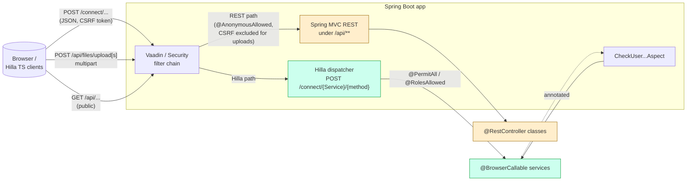

> Branch: `dev-split` — captured 2026-04-25.

# Hilla services & REST endpoints

## Purpose

Catalogue every server-side surface exposed to the browser, distinguish the
two transport mechanisms (Vaadin Hilla RPC vs. plain Spring MVC REST), and
document the auth annotations that gate each service.

## Contents

- [Diagram — server surface, two channels](#diagram--server-surface-two-channels)
- [Narrative](#narrative)
  - [Two transports, one filter chain](#two-transports-one-filter-chain)
  - [Hilla service catalogue](#hilla-service-catalogue)
  - [Generic CRUD bases](#generic-crud-bases)
  - [Hand-written REST controllers](#hand-written-rest-controllers)
  - [WebSocket — third channel](#websocket--third-channel)
  - [Worked example — saving a `Sample`](#worked-example--saving-a-sample)
- [Where to look in the code](#where-to-look-in-the-code)
- [The REST surface — complete list](#the-rest-surface--complete-list)
- [`ControllerEndpoint` is a hardware input, not a stub](#controllerendpoint-is-a-hardware-input-not-a-stub)
- [Open questions](#open-questions)

## Diagram — server surface, two channels

## Narrative

### Two transports, one filter chain

The app exposes two different shapes of HTTP API:

* **Hilla RPC.** Java methods on a `@BrowserCallable` class are auto-mapped to
  `POST /connect/{ServiceName}/{methodName}`. Vaadin generates TypeScript
  stubs into `src/main/frontend/generated/`, so the call site is
  `import { list, save } from 'Frontend/generated/SampleService'` (one TS file
  per service). The connect client adds the CSRF / session token, serialises
  arguments to JSON, and propagates `@RolesAllowed` failures as exceptions on
  the TS side.
* **Spring MVC REST.** Three `@RestController` classes serve under
  `/api/**`. They are excluded from Vaadin routing
  (`vaadin.exclude-urls=/api/**` in `cms/src/main/resources/application.properties:16`)
  and treated as anonymous by the security filter
  (`cms/src/main/java/ch/rupfizupfi/deck/security/SecurityConfiguration.java:39`).

### Hilla service catalogue

All services live under the same package on each module
(`ch.rupfizupfi.deck.api.services`). The cms module exposes 11 services; the
command-deck module adds 3 hardware services. Inheriting from the generic
CRUD bases means most services have no Java body at all.

| Service | Module | Auth | Base | Notes |
|---|---|---|---|---|
| `CustomerService` | cms | `@PermitAll` | `CrudRepositoryService<Customer, ...>` | open CRUD |
| `ProjectService` | cms | `@PermitAll` | `CrudRepositoryServiceForOwnerData<Project, ...>` | owner-filtered list/get/delete |
| `SampleService` | cms | `@PermitAll` + `@CheckUserCanOnlyAccessOwnData` | `CrudRepositoryService<Sample, ...>` | aspect on get/save/delete |
| `TestParameterService` | cms | `@PermitAll` + `@CheckUserCanOnlyAccessOwnData` | `CrudRepositoryService<TestParameter, ...>` | aspect on get/save/delete |
| `TestResultService` | cms | `@PermitAll` | `CrudRepositoryServiceForOwnerData<TestResult, ...>` | adds `listCSVResults`, `readCSVData` |
| `MaterialService` | cms | `@PermitAll` | `CrudRepositoryService<Material, ...>` | reference data |
| `GearTypeService` | cms | `@PermitAll` | `CrudRepositoryService<GearType, ...>` | reference data |
| `GearStandardService` | cms | `@PermitAll` | `CrudRepositoryService<GearStandard, ...>` | reference data |
| `FileMetadataService` | cms | `@PermitAll` | `CrudRepositoryService<FileMetadata, ...>` | metadata only — bytes via `/api/files/...` |
| `UserService` | cms | `@RolesAllowed("ROLE_ADMIN")` | `CrudRepositoryService<User, ...>` | overrides `save` to bcrypt `newPassword` |
| `SettingService` | cms | `@PermitAll` | implements `CrudService` directly | file-backed settings (no JPA) |
| `TestRunnerService` | command-deck | `@PermitAll` | — | exposes `start(testId)`, `status()`, `stop()` |
| `DeviceInfoService` | command-deck | `@PermitAll` | — | toggles broadcaster on/off |
| `SuckService` | command-deck | `@PermitAll` | — | toggles 4-way relay |

One more browser-callable surface sits outside that package and outside the
table: `UserEndpoint`
(`cms/src/main/java/ch/rupfizupfi/deck/api/UserEndpoint.java:22`) is annotated
with the older `@Endpoint` rather than `@BrowserCallable`, and is
`@AnonymousAllowed` because `useAuth()` must be able to ask who is signed in
*before* anyone is. It exposes `getAuthenticatedUser()` and an admin-filtered
`list(Pageable, Filter)`.

`@PermitAll` on Hilla means "any authenticated user". The Hilla framework
denies anonymous calls by default; the only ways out are
`@AnonymousAllowed` or putting the URL through `permitAll()` in
`SecurityConfiguration`. [`../_inventory.md`](../_inventory.md) §2.1 lists every service with its file
path.

### Generic CRUD bases

* `CrudRepositoryService<T, R>`
  (`cms/src/main/java/ch/rupfizupfi/deck/hilla/crud/CrudRepositoryService.java:6`)
  thinly extends Hilla's `com.vaadin.hilla.crud.CrudRepositoryService` and
  exposes `getCrudRepository()` so the AOP aspect can resolve a repository
  from a CRUD service join-point target.
* `CrudRepositoryServiceForOwnerData<T extends DataWithOwner, R>`
  (`cms/.../hilla/crud/CrudRepositoryServiceForOwnerData.java:17`) — the
  owner-aware subclass detailed in
  [`security-and-tenancy.md`](security-and-tenancy.md). It overrides `get`,
  `list`, `delete` to AND an `owner = currentUser OR owner IS NULL`
  specification.

The Hilla framework requires the entity ID type as a generic parameter; this
codebase fixes it to `Long` everywhere.

### Hand-written REST controllers

All three live in `cms/src/main/java/ch/rupfizupfi/deck/api/rest/`:

| Class | Path | Purpose | Auth |
|---|---|---|---|
| `ControllerEndpoint` | `GET /api/ControllerEndpoint/press/{button}` | input from the physical button box on the tester | `@AnonymousAllowed` |
| `FileEndpoint` | `POST /api/files/uploads`, `POST /api/files/upload`, `GET /api/files/image/{fileName}` | multipart upload + download | `@AnonymousAllowed` |
| `DownloadResults` | `GET /api/DownloadEndpoint/get`, `GET /api/DownloadEndpoint/project/{projectId}` | XLSX export of test results via Apache POI | `@PermitAll` |

The REST surface exists because:

1. Hilla doesn't natively handle multipart upload (`FileEndpoint`).
2. Bulk file download with custom HTTP headers is awkward through Hilla
   (`DownloadResults`).
3. `ControllerEndpoint` is called by hardware that cannot speak Hilla RPC.

The `/api/**` permit-all rule in `SecurityConfiguration` means anyone can hit
these without a session. That is deliberate — the per-class
`@AnonymousAllowed` / `@PermitAll` annotations are documentation rather than
enforcement on these paths, because the filter chain already permitted them.
See [`security-and-tenancy.md`](security-and-tenancy.md).

### WebSocket — third channel

Real-time streaming uses STOMP-over-WebSocket, configured by
`WebSocketConfig` (`cms/src/main/java/ch/rupfizupfi/deck/messaging/WebSocketConfig.java:11`):

* `enableSimpleBroker("/topic")`
* `setApplicationDestinationPrefixes("/app")`
* Endpoints: `/status`, `/logs`

The producers are `ForceBroadcaster`, `DeviceInfoBroadcaster`, and
`TestLogger.log` (which fans out to `/topic/logs`). The consumers are React
components subscribing via `@stomp/rx-stomp`. See
[`hardware-integration.md`](hardware-integration.md) for the topic list.

WebSocket auth piggy-backs on the HTTP session — the STOMP CONNECT happens
over the same Vaadin-protected origin.

### Worked example — saving a `Sample`

1. Frontend calls `SampleService.save(sample)` from
   `Frontend/generated/SampleService.ts`.
2. Hilla connect-client posts JSON to `/connect/SampleService/save` with the
   session token.
3. The Vaadin filter chain validates the session, then the Hilla dispatcher
   resolves `SampleService.save` and reflects it.
4. Spring AOP intercepts: `CheckUserCanOnlyAccessOwnDataAspect.checkUserAccess`
   inspects the `Sample` argument. Sample implements `DataWithOwner`; if
   `sample.owner != null && != currentUser`, throw.
5. The (inherited) `save` method on `CrudRepositoryService` saves via
   `SampleRepository`.
6. The persisted `Sample` is JSON-serialised back; `OwnerSerializer` collapses
   the owner relationship to a `{id, name}` stub to avoid leaking other
   users' details.

## Where to look in the code

| Concern | File |
|---|---|
| Hilla services | `cms/src/main/java/ch/rupfizupfi/deck/api/services/` (11 files) and `command-deck/src/main/java/ch/rupfizupfi/deck/api/services/` (3 files) |
| Generic CRUD base | `cms/src/main/java/ch/rupfizupfi/deck/hilla/crud/CrudRepositoryService.java` |
| Owner-aware CRUD | `cms/src/main/java/ch/rupfizupfi/deck/hilla/crud/CrudRepositoryServiceForOwnerData.java:17` |
| REST controllers | `cms/src/main/java/ch/rupfizupfi/deck/api/rest/{ControllerEndpoint,FileEndpoint,DownloadResults}.java` |
| Generated TS clients | `cms/src/main/frontend/generated/*Service.ts` and `command-deck/src/main/frontend/generated/{TestRunnerService,DeviceInfoService,SuckService}.ts` |
| Vaadin URL exclusion | `cms/src/main/resources/application.properties:16` (`vaadin.exclude-urls=/api/**`) |
| WebSocket config | `cms/src/main/java/ch/rupfizupfi/deck/messaging/WebSocketConfig.java:11` |

## The REST surface — complete list

Three `@RestController` classes, all in
`cms/src/main/java/ch/rupfizupfi/deck/api/rest/`, all under `/api/**` and
therefore all anonymous (see
[`security-and-tenancy.md`](security-and-tenancy.md)):

| Method + path | Class | Purpose |
|---|---|---|
| `POST /api/files/uploads` | `FileEndpoint` | Multi-file upload → `List<FileMetadata>`. CSRF-exempt. |
| `POST /api/files/upload` | `FileEndpoint` | Single-file upload → `FileMetadata`. CSRF-exempt. |
| `GET /api/files/image/{fileName}` | `FileEndpoint` | Serve an uploaded image. |
| `GET /api/DownloadEndpoint/get` | `DownloadResults` | Returns a string; diagnostic. |
| `GET /api/DownloadEndpoint/project/{projectId}` | `DownloadResults` | CSV export of a project's results (`projectId` constrained to digits). |
| `GET /api/ControllerEndpoint/press/{button}` | `ControllerEndpoint` | Physical button box input — see below. |

`vaadin.exclude-urls=/api/**` in `application.properties` keeps these
paths out of Vaadin's routing.

## `ControllerEndpoint` is a hardware input, not a stub

`GET /api/ControllerEndpoint/press/{button}` looks like leftover
debugging — it logs the button name and echoes it back. It is not: a
**physical button box wired to the tester** calls it. Nothing in this
repository invokes it, which is why it reads as dead code.

Do not delete it, and do not move it behind authentication — see the
`/api/**` decision in
[`security-and-tenancy.md`](security-and-tenancy.md). The button box's
firmware, its wiring, and what each `{button}` value is expected to do are
not documented anywhere; today the endpoint only logs, so no behaviour
depends on those semantics yet.

## Open questions

1. **`generated/` TypeScript stubs are gitignored *and* tracked.**
   Decided 2026-08-16: fully untrack. Needs `git rm --cached` across both
   modules' `generated/` trees, and confirmation that a clean build
   regenerates everything the frontend build needs. (OQ-14)
2. **`SettingService` implements `CrudService` directly** rather than
   extending `CrudRepositoryService`, because `Setting` is not a JPA
   entity. Add a one-line comment so the next reader doesn't take it for
   an oversight. (OQ-42)
