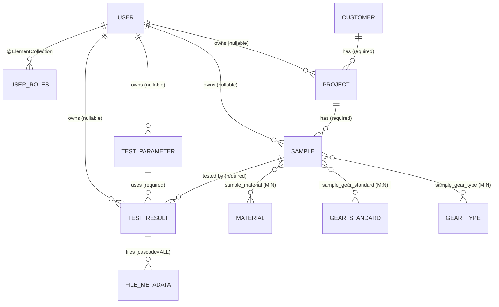

> Branch: `dev-split` — captured 2026-04-25.

# Persistence model

## Purpose

Catalogue every JPA entity, its key columns, and its relationships, so a new
engineer can read a `TestResult` and follow the chain back to a `Customer`
without opening ten Java files.

All entities live in `:cms` (`cms/src/main/java/ch/rupfizupfi/deck/data/`).
The `:command-deck` module declares **no** `@Entity` of its own; it consumes
the cms data classes via the `implementation project(':cms')` dependency. The
shared root package `ch.rupfizupfi.deck` lets Spring Boot's default
component-scan / `@EntityScan` pick up cms types from a `:command-deck`
boot run.

## Contents

- [Diagram](#diagram)
- [Narrative](#narrative)
  - [Common base class](#common-base-class)
  - [Domain shape](#domain-shape)
  - [Reference data (no owner)](#reference-data-no-owner)
  - [`Setting` is *not* a JPA entity](#setting-is-not-a-jpa-entity)
  - [Ownership marker](#ownership-marker)
  - [DDL strategy](#ddl-strategy)
  - [Seed data](#seed-data)
- [Where to look in the code](#where-to-look-in-the-code)
- [`TestParameter.type` is deliberately free-form](#testparametertype-is-deliberately-free-form)
- [Open questions](#open-questions)

## Diagram



Source: [`doc/diagrams/src/er-diagram.mmd`](../diagrams/src/er-diagram.mmd).

## Narrative

### Common base class

Every entity extends `AbstractEntity`
(`cms/src/main/java/ch/rupfizupfi/deck/data/AbstractEntity.java:7`):

* `@Id @GeneratedValue(IDENTITY)` — `Long id`.
* `@Version int version` — optimistic-locking version column.
* `equals` / `hashCode` keyed on `id` (or fall through if the row is transient).

There is no shared `@CreatedDate` / `@UpdatedDate` auditing.

### Domain shape

The data flow is a funnel:

```
Customer -> Project -> Sample -> TestResult <- TestParameter
                                       └── FileMetadata*
```

* **`Customer`** (`Customer.java`) — pure CRM record (organization,
  firstname, lastname, email + Swiss postal code regex `^\d{4,5}$`). Not
  ownership-scoped.
* **`Project`** (`Project.java:12`) — owned by an optional `User`, references
  exactly one `Customer` (`optional=false`). Implements `DataWithOwner`.
* **`Sample`** (`Sample.java:17`) — physical specimen under test. Owned by
  optional `User`, belongs to one `Project`, joined many-to-many to
  `GearType`, `GearStandard`, `Material` via the join tables
  `sample_gear_type`, `sample_gear_standard`, `sample_material`.
* **`TestParameter`** (`TestParameter.java:13`) — reusable recipe (`type` is a
  free-form string, but `TestRunnerThread.run()` only switches on `cyclic`,
  `timeCyclic`, `destructive`). Holds limits, ramp times, cycle count.
* **`TestResult`** (`TestResult.java:15`) — the actual test run. Joins one
  `Sample` and one `TestParameter`, owns a `List<FileMetadata>` with
  `cascade=ALL` + `orphanRemoval=true` (delete a `TestResult` and its files
  go too — modulo the actual files on disk, which are the
  `CSVStoreService` / `StorageLocationService`'s problem, see
  [`hardware-integration.md`](hardware-integration.md)).
* **`FileMetadata`** (`FileMetadata.java:9`) — file pointer; the bytes live on
  the host filesystem, only `fileName` + `filePath` (relative) are persisted.
* **`User`** (`User.java:11`) — username + bcrypt hashed password + `Set<Role>`
  via `@ElementCollection` (table `user_roles`, role values stored as
  enum strings). The `application_user` table name is forced because `user`
  is reserved in PostgreSQL.

### Reference data (no owner)

`GearType`, `GearStandard`, `Material` are unscoped lookup tables seeded by
`data.sql` (only present in cms — see [`05-ops/db.md`](../05-ops/db.md)).

### `Setting` is *not* a JPA entity

Despite living under `data/`, `Setting<T>` and `SettingRepository` persist
to a JSON file (`settings.json`) on disk, not the database. `SettingRepository`
is annotated `@Service` (not `@Repository`) because there is no Spring Data
repository to derive from, and writes through Jackson's `ObjectMapper` to
either `${user.dir}/settings.json` (dev) or
`${user.home}/breaktester/settings.json` (docker). See
`cms/src/main/java/ch/rupfizupfi/deck/data/SettingRepository.java`.

### Ownership marker

`DataWithOwner`
(`cms/src/main/java/ch/rupfizupfi/deck/security/DataWithOwner.java:6`)
is a marker interface with a single nullable `getOwner()` method. The
ownership-bearing entities are: `Project`, `Sample`, `TestParameter`,
`TestResult`. `User` itself is **not** `DataWithOwner` — it is owner-managed
through `@RolesAllowed("ROLE_ADMIN")` on `UserService` instead.

A null owner means "system-owned" / shared — `OwnerDataHelper.buildOwnerQuery`
explicitly OR-s `owner = :user OR owner IS NULL`
(`cms/.../OwnerDataHelper.java:26`).

See [`security-and-tenancy.md`](security-and-tenancy.md) for how the ownership
filter is applied at query time.

### DDL strategy

`spring.jpa.hibernate.ddl-auto=update` in both `dev` and `docker` profiles
(`cms/src/main/resources/application-dev.properties`,
`application-docker.properties`). There is **no** Flyway / Liquibase, and that
is a deliberate decision, not a gap — see
[`../05-ops/db.md`](../05-ops/db.md) for the reasoning and the manual cost it
carries.

### Seed data

`cms/src/main/resources/data.sql` runs when `spring.sql.init.mode=always`
**and** the `Application`-declared initializer finds `application_user` empty.
The inserts use fixed IDs and are **not** idempotent — the emptiness check is
what prevents a re-run. It seeds:

* Two users (`user` / `admin`, both bcrypt-hashed).
* `gear_type`, `gear_standard`, `material` lookup rows.
* One demo `customer`.

`:command-deck` has no `data.sql` of its own, but the cms one reaches it
through the `cms-library` jar on its classpath, so a deck-only boot against
an empty database seeds normally. In dev both modules share `./.data/deck`,
so whichever booted first owns the file — and only one at a time, since H2
locks it exclusively. See [`../05-ops/db.md`](../05-ops/db.md).

## Where to look in the code

| Concern | File |
|---|---|
| Base class | `cms/src/main/java/ch/rupfizupfi/deck/data/AbstractEntity.java` |
| Entities | `cms/src/main/java/ch/rupfizupfi/deck/data/*.java` (10 `@Entity` classes) |
| Repositories | `cms/src/main/java/ch/rupfizupfi/deck/data/*Repository.java` (interfaces extending `JpaRepository`+`JpaSpecificationExecutor`) |
| Hilla CRUD bridge | `cms/src/main/java/ch/rupfizupfi/deck/hilla/crud/CrudRepositoryService.java` |
| Owner-scoped CRUD | `cms/src/main/java/ch/rupfizupfi/deck/hilla/crud/CrudRepositoryServiceForOwnerData.java:17` |
| Settings (file-backed) | `cms/src/main/java/ch/rupfizupfi/deck/data/SettingRepository.java:18` |
| Seed data | `cms/src/main/resources/data.sql` |

## `TestParameter.type` is deliberately free-form

The column is a plain string and stays that way (decided 2026-08-16). An
enum was considered and declined: users define their own parameter types
through the UI, and only some of them drive the test runner.

Exactly three values are executable —
`"destructive"`, `"cyclic"`, `"timeCyclic"` — dispatched by the switch in
`TestRunnerThread.run()`. Every other value is a valid, storable parameter
type that simply has no runner behind it. See
[`test-execution-engine.md`](test-execution-engine.md) for what happens
when one of those is used to start a run.

## Open questions

1. **Delete the profile-picture blobs.** `User` stores image bytes inline
   in `application_user`, seeded from `data.sql`. Decided 2026-08-16:
   remove the feature rather than migrate it to `FileMetadata` — the
   column, the seed data and the UI that reads it all go. (OQ-34)
2. **`TestResult.files` cascade + orphan-removal is unverified.** There is
   no test suite, so the cascade behaviour is asserted only by reading the
   mapping. (OQ-32)
