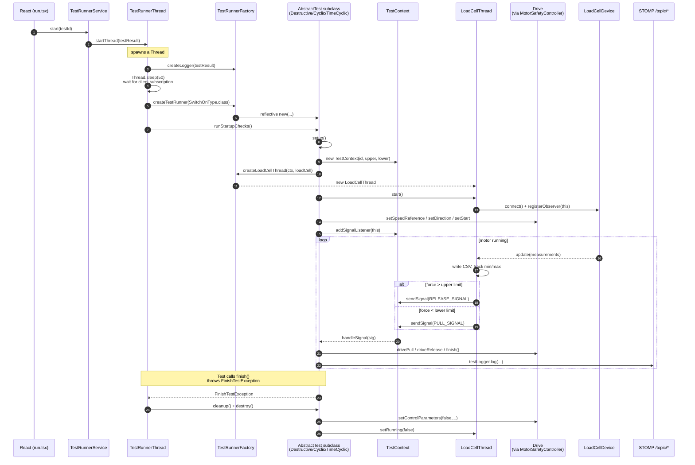

> Branch: `dev-split` — revised 2026-08-17.

# Test execution engine

## Purpose

A test run is the most safety-relevant operation in the system: an electric
motor pulls or releases a physical specimen until something either reaches a
force threshold or breaks. This page covers the **control plane** — how a run
starts, is driven, and is shut down.

The test implementations themselves (the `AbstractTest` contract, the three
strategies, the `FinishTestException` termination idiom, and the measurement
thread they drive) are in [`test-types.md`](test-types.md).

## Contents

- [Diagram — lifecycle](#diagram--lifecycle)
- [Entry point — `TestRunnerService`](#entry-point--testrunnerservice)
- [`TestRunnerFactory`](#testrunnerfactory)
- [`TestRunnerThread.run()`](#testrunnerthreadrun)
- [`TestContext` — the signal bus](#testcontext--the-signal-bus)
- [Startup checks](#startup-checks)
- [Unrunnable parameter types](#unrunnable-parameter-types)
- [Where to look in the code](#where-to-look-in-the-code)
- [Open questions](#open-questions)

## Diagram — lifecycle


```mermaid
sequenceDiagram
    autonumber
    participant FE as React (run.tsx)
    participant Hilla as TestRunnerService
    participant TRT as TestRunnerThread
    participant TRF as TestRunnerFactory
    participant Test as AbstractTest subclass<br/>(Destructive/Cyclic/TimeCyclic)
    participant TC as TestContext
    participant LCT as LoadCellThread
    participant CFW as Drive<br/>(via MotorSafetyController)
    participant LC as LoadCellDevice
    participant Topic as STOMP /topic/*

    FE->>Hilla: start(testId)
    Hilla->>TRT: startThread(testResult)
    Note over TRT: spawns a Thread
    TRT->>TRF: createLogger(testResult)
    TRT->>TRT: Thread.sleep(50)<br/>wait for client subscription
    TRT->>TRF: createTestRunner(SwitchOnType.class)
    TRF->>Test: reflective new(...)
    TRT->>Test: runStartupChecks()
    Test->>Test: setup()
    Test->>TC: new TestContext(id, upper, lower)
    Test->>TRF: createLoadCellThread(ctx, loadCell)
    TRF-->>LCT: new LoadCellThread
    Test->>LCT: start()
    LCT->>LC: connect() + registerObserver(this)
    Test->>CFW: setSpeedReference / setDirection / setStart
    Test->>TC: addSignalListener(this)

    loop motor running
        LC-->>LCT: update(measurements)
        LCT->>LCT: write CSV, track min/max
        alt force > upper limit
            LCT->>TC: sendSignal(RELEASE_SIGNAL)
        else force < lower limit
            LCT->>TC: sendSignal(PULL_SIGNAL)
        end
        TC-->>Test: handleSignal(sig)
        Test->>CFW: drivePull / driveRelease / finish()
        Test->>Topic: testLogger.log(...)
    end

    Note over Test,TRT: Test calls finish()<br/>throws FinishTestException
    Test--xTRT: FinishTestException
    TRT->>Test: cleanup() + destroy()
    Test->>CFW: setControlParameters(false,...)
    Test->>LCT: setRunning(false)
```

## Entry point — `TestRunnerService`

`TestRunnerService`
(`command-deck/src/main/java/ch/rupfizupfi/deck/api/services/TestRunnerService.java:13`)
is `@BrowserCallable @PermitAll`. It owns *one* `TestRunnerThread` (created
once via `TestRunnerFactory.createTestRunnerThread()` in the constructor).
Three methods: `start(Long testId)` looks up the `TestResult` row and hands it
to the thread; `status()` returns whether the thread is running plus the
active `TestResult` (or `null`); `stop()` asks the thread to wind down.

Because the service is a singleton holding one thread, **only one test can
run at a time** on this server. That matches the physical reality — one
motor, one specimen.

## `TestRunnerFactory`

`TestRunnerFactory` (`command-deck/.../testrunner/TestRunnerFactory.java:15`)
is a `@Service` that uses reflection to instantiate the right `AbstractTest`
subclass. It inspects the constructor parameters and fills:

* `TestResult` → the result row
* `TestRunnerFactory` → itself
* `TestLogger` → a per-run logger
* anything else → resolved from the Spring `ApplicationContext`

This is how `DestructiveTest`, `CyclicTest` and `TimeCyclicTest` share the
signature `(TestResult, TestLogger, TestRunnerFactory, DeviceService)` while
still participating in DI for future parameters.

It also exposes `createLoadCellThread(TestContext, LoadCellDevice)`,
`createLogger(TestResult)`, and `getStartupChecks()` — currently a
`FileSystemCheck` and a `LoadCellCheck`
(`command-deck/src/main/java/ch/rupfizupfi/deck/testrunner/TestRunnerFactory.java:75`).

## `TestRunnerThread.run()`

`TestRunnerThread` (`command-deck/.../testrunner/TestRunnerThread.java:10`)
is **not** a `Thread`; it owns one.

1. `startThread(TestResult)` creates a `TestLogger`, calls `begin()` (opens
   the per-test log file under the result-data location), and starts the
   `Thread` named `TestRunnerThread`. Every failure on that path releases the
   run scope and throws, so a start that began no run reaches the operator as
   an error rather than as a silent success.
2. The thread sleeps 50 ms — empirically enough for the React client to
   subscribe to `/topic/logs` so users see the first lines. This is a race,
   not a guarantee (OQ-23, see
   [`../04-frontend/state-and-realtime.md`](../04-frontend/state-and-realtime.md)).
3. Switches on `testResult.testParameter.type` to pick the subclass. An
   unknown type faults the run naming the type — see
   [below](#unrunnable-parameter-types).
4. Calls `runStartupChecks()` → `setup()` → `getContext().processSignals()`.
5. `processSignals()` blocks on `signalQueue.take()` forever; the only exits
   are `InterruptedException` (from `stopThread()`) or `FinishTestException`
   (the test decided it's done).
6. The `finally` block always calls `cleanup()` and `destroy()`. If *those*
   throw — USB cable yanked, say — `retryShutdownOnException()` runs
   `MotorSafetyController.safeStop`, whose tier 2 drops the device-service
   handle and opens a fresh one through `DriveProvider` to force the motor off.
   **This is the most safety-critical block in the codebase.**
7. The same `finally` settles a terminal state, records the run outcome and
   ends the `TestLogger`, so the log descriptor is closed on every exit — a
   natural finish, a fault and an operator Stop alike. `TestLogger.end()` claims
   the writer in a single read, so it is idempotent even against a concurrent
   `end()` — which is what lets `stopThread()` end the same logger — and `log()`
   absorbs a rejected STOMP broadcast as well as a file-write failure.

`stopThread()` puts a sentinel `0` on the queue via
`TestContext.sendSignal(0)`, which `CyclicTest.handleSignal` translates into
`finish()`. If the thread hasn't exited within 1 s it is interrupted, then
joined.

## `TestContext` — the signal bus

`TestContext` (`command-deck/.../testrunner/TestContext.java:8`) is a small
in-memory bus:

* `LinkedBlockingQueue<Integer> signalQueue` — `LoadCellThread` pushes,
  `processSignals()` pops.
* `addSignalListener(...)` / `removeSignalListener(...)` — fan out to
  `AbstractTest` subclasses.
* Signal values: `RELEASE_SIGNAL = 1`, `PULL_SIGNAL = 2`, `0` = stop.
  `SENSOR_LOST_SIGNAL = 3` is declared and **never sent** — every consumer acts
  on whatever it pops, so a bookkeeping-only value would be indistinguishable
  from a command; `TestStateMachine` carries that instead.
* `sendSignal` is a no-op when the same signal arrives twice in a row, **except
  for `0`** — which also bypasses the dispatch gate. Without both exemptions the
  watchdog's stop swallowed the operator's Stop.

Limit values (`upperLimit`, `lowerLimit`) are held in Newtons and mutated by
`CyclicTest.handleSignal` to compensate for overshoot: measured min/max
diverge from target, so the limit is nudged to turn the motor around earlier
next cycle. `TestContext` refuses a **non-finite** limit outright, and
`LoadCellThread` skips a non-finite sample rather than comparing it: a NaN makes
every comparison false, which used to mean no signal ever fired again with the
motor still driving.

## Startup checks

`AbstractCheck`
(`command-deck/.../testrunner/startup/check/AbstractCheck.java`) defines a
single `execute() throws CheckFailedException`. Three implementations run today:

* `FileSystemCheck` — the result-data directory exists and is writable.
* `LoadCellCheck` — the load cell delivers a *fresh* measurement within 2 s.
  Opening the device is not evidence: the driver opens the port on its own
  thread, so a device that is not plugged in still connects and reports itself
  connected.
* `FrequencyInverterCheck` — one `getControlParameters` read through the shared
  drive handle proves the inverter answers. Nothing is written, and the connect
  is balanced so the run's own connect still opens a fresh reference count.

`AbstractTest.runStartupChecks()` aggregates failures into one combined
`CheckFailedException`.

To add a check: subclass `AbstractCheck` and return it from
`TestRunnerFactory.getStartupChecks()` — no `@Component` auto-discovery.

## Unrunnable parameter types

`TestRunnerThread.run()` dispatches on the free-form
`testResult.testParameter.type` string, and the `default` branch throws:

```java
default -> throw new IllegalArgumentException(
        "unknown test parameter type: " + testResult.testParameter.type);
```

The free-form column is deliberate (see
[`persistence-model.md`](persistence-model.md)) — users create parameter
types that have no runner. Starting a run with one writes
`unknown test parameter type: <type>` to the test log and settles the run
`FAULT` with the same reason, which `TestStateBroadcaster` carries to the
operator. The type stays a string; an enum was refused.

## Where to look in the code

| Concern | File |
|---|---|
| Hilla entry point | `command-deck/src/main/java/ch/rupfizupfi/deck/api/services/TestRunnerService.java:13` |
| Factory | `command-deck/src/main/java/ch/rupfizupfi/deck/testrunner/TestRunnerFactory.java:15` |
| Thread driver | `command-deck/src/main/java/ch/rupfizupfi/deck/testrunner/TestRunnerThread.java:10` |
| Signal bus | `command-deck/src/main/java/ch/rupfizupfi/deck/testrunner/TestContext.java:8` |
| Logger (file + STOMP `/topic/logs`) | `command-deck/src/main/java/ch/rupfizupfi/deck/testrunner/TestLogger.java:17` |
| Pre-test checks | `command-deck/src/main/java/ch/rupfizupfi/deck/testrunner/startup/check/` |

Test implementations and the measurement thread: [`test-types.md`](test-types.md).

## Open questions

1. **The safe-stop escalation opens a second drive handle** on the same USB
   device (`MotorSafetyController#stopWithFreshHandle` → `DriveProvider.open()`).
   Tier 2 closes the old handle first, under the drive lock, so the overlap is
   meant to be zero. Decided 2026-08-16: **investigate before changing
   anything.** This is the emergency-stop path on a motor-driven rig, so the
   question is whether two modbus handles on one device is safe, not merely
   whether it's tidy.
   Outcome is a documented finding plus either a reuse refactor or an inline
   note explaining why a fresh handle is correct. (OQ-50)
2. **Reflection-based factory.** Constructor lookup requires exactly one public
   constructor and refuses the run naming the count found — `Class#getConstructors`
   defines no order. An unresolvable parameter is named with its index and type.
3. **The engine's structure itself** — two locks on one drive handle, per-run
   safety state in a `@Service`, three near-identical `setup()` bodies.
   Proposed restructuring, not decided:
   [hardware-layer-redesign](../06-feature-work/hardware-layer-redesign/README.md),
   which would delete the reflective factory outright. (OQ-64)
