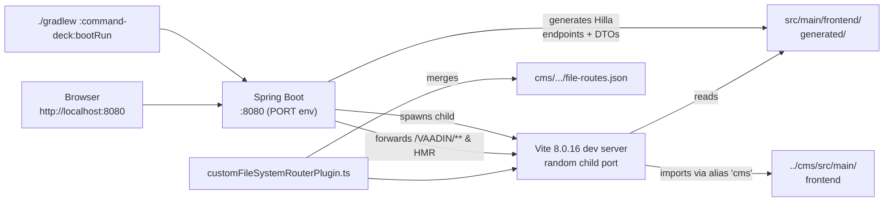

# Frontend build & tooling

> Branch: `dev-split` &middot; Snapshot: 2026-04-25 &middot; 04-frontend

## Purpose

Explain how the React/TypeScript frontend is actually served at dev time, what
the production build flag flips, and the (non-trivial) ways `command-deck`'s
`vite.config.ts` diverges from a stock Vaadin/Hilla setup. Read this before
touching anything in `vite.config.ts` or the `frontend/generated/` tree.

## Contents

- [Diagram — dev-server handshake](#diagram--dev-server-handshake)
- [Narrative](#narrative)
  - [Dev mode (`./gradlew :command-deck:bootRun`)](#dev-mode-gradlew-command-deckbootrun)
  - [Production build (`-Pvaadin.productionMode=true`)](#production-build--pvaadinproductionmodetrue)
  - [Where `command-deck/vite.config.ts` diverges from `cms/vite.config.ts`](#where-command-deckviteconfigts-diverges-from-cmsviteconfigts)
- [Where to look in the code](#where-to-look-in-the-code)
- [Package manager: pnpm](#package-manager-pnpm)
- [Open questions](#open-questions)

## Diagram — dev-server handshake

## Narrative

### Dev mode (`./gradlew :command-deck:bootRun`)
1. Gradle invokes the Vaadin Spring Boot starter, which on first request boots
   the embedded Vite dev server as a **child process** of Spring Boot.
2. The browser only ever talks to Spring on port `8080` (see
   `application-dev.properties` — `${PORT:8080}`). Spring proxies
   `/VAADIN/**`, the websocket-based HMR channel, and the Hilla generated
   modules through to the Vite child.
3. While the JVM is starting, the Vaadin Maven/Gradle plugin walks every
   `@BrowserCallable` Java class and (re)writes the matching files under
   `src/main/frontend/generated/`. Vite picks these up as ordinary TS modules
   — it has no idea they came from Java.
4. `vaadin.devmode.devTools.enabled=false` in `application.properties:9` keeps
   the Vaadin dev tools popup out of the page. Dev tools is re-enabled in
   `application-dev.properties` (per the inventory).
5. `vaadin.launch-browser=true` opens the default browser on Spring start.

### Production build (`-Pvaadin.productionMode=true`)
- The default in the root `build.gradle:65` is
  `vaadin { productionMode = false; optimizeBundle = false }`. The `-P` flag
  overrides it.
- With production mode on, the Vaadin Gradle plugin runs `vite build` (rather
  than starting a dev server), produces a hashed/minified bundle in
  `command-deck/build/vaadin-generated/META-INF/VAADIN/`, embeds it in the fat
  JAR, and disables the live-reload websocket.
- `optimizeBundle=true` (kept off here) would additionally strip unused
  components from the Vaadin component bundle. Default-off is intentional
  while the route tree is still in flux on `dev-split`.

### Where `command-deck/vite.config.ts` diverges from `cms/vite.config.ts`

`cms/vite.config.ts` is 12 lines: it just adds an alias `'cms'` pointing at
its own `frontend/` directory. `command-deck/vite.config.ts` is **69 lines** and
adds three load-bearing pieces on top of `overrideVaadinConfig`:

1. **Cross-module alias** — `'cms'` resolves to `../cms/src/main/frontend`
   (`command-deck/vite.config.ts:47`). That is what lets `views/run.tsx:4`
   write
   `import {createAutoComboBoxService} from "cms/components/combobox/service";`
   and reuse the cms-side AutoCrud/Owner/AutoComboBox machinery without
   publishing a shared package.
2. **A computed `resolve.dedupe` list** (`command-deck/vite.config.ts:38-49`).
   cms sources reached through the alias would otherwise resolve their bare
   imports against `cms/node_modules/`, shipping two copies of `react`,
   `react-router`, `lit` and every `@vaadin` component — hooks throw and the
   chart blanks. The list is built at config time from this module's
   `dependencies` plus the Vaadin-managed version pins, so it cannot drift
   from what is actually installed. Under pnpm the Vaadin plugin writes those
   pins to `command-deck/pnpm-workspace.yaml` (`overrides:`, lines 2-102)
   rather than to `package.json`, so `pnpmWorkspaceOverrides()` reads that
   file too — otherwise the dedupe list silently shrinks when the package
   manager changes.
3. **Custom file-router plugin** — `customFileSystemRouterPlugin.ts`.
   It hooks into the Vaadin `vite-plugin-file-router`'s `buildStart`
   *and* listens for `fs-route-update` HMR events. After each rebuild it
   reads `command-deck/.../file-routes.json` and the sibling
   `cms/.../file-routes.json`, deep-merges them by route path
   (`mergeRoutesArrays`), and writes the union back into the command-deck
   file. That is **why** the deck's MainLayout shows menu items for
   cms-only views like `customer` and `system/*`. See
   `command-deck/src/main/frontend/routes.tsx:4` — it imports
   `cms/generated/file-routes` *and* the local one and stacks both via
   `withFileRoutes(...)` calls.
4. **Rollup tweak** — `preserveEntrySignatures: 'strict'` and a silenced
   `MIXED_EXPORTS` warning to keep the cross-module imports happy in the
   production bundle.

`cms/vite.config.ts` has none of this; it is a single-module standalone build.

## Where to look in the code
- `command-deck/vite.config.ts:1-69`
- `command-deck/customFileSystemRouterPlugin.ts:104-143`
- `cms/vite.config.ts:1-12`
- `command-deck/src/main/frontend/routes.tsx:1-38`
- `build.gradle:64-67` (`vaadin { productionMode; optimizeBundle }`)
- `cms/src/main/resources/application.properties:1-17`
- `command-deck/pnpm-workspace.yaml:2-102` (`overrides` block pinning `@vaadin/*`)

## Package manager: pnpm

`build.gradle` sets `pnpmEnable = true` for both subprojects, with
`vaadin.pnpm.enable=true` mirrored in `application.properties` so dev mode
and the Gradle build install the same way. `useGlobalPnpm` stays off —
Vaadin fetches its own pinned pnpm.

The two modules still have separate `package.json` and `node_modules/`
directories, but pnpm hard-links from a shared content store, so the
duplicated dependency trees no longer cost duplicated disk. That is why
npm/yarn workspaces were not needed.

## Open questions

1. **`optimizeBundle` is off** (`build.gradle`, both subprojects) with no
   recorded reason. Decided 2026-08-16: leave it off until someone
   measures the production bundle both ways — the cross-module alias may
   interact badly with tree-shaking, which is the likeliest original
   motive. Measure, then decide; don't flip it blind. (OQ-16)
2. **Can the Hilla generator run without booting the JVM app?** Today it
   runs as part of `bootRun`, so there is no cheap CI-only TypeScript
   typecheck. If it can't be run standalone, record why and close.
   (OQ-17)
