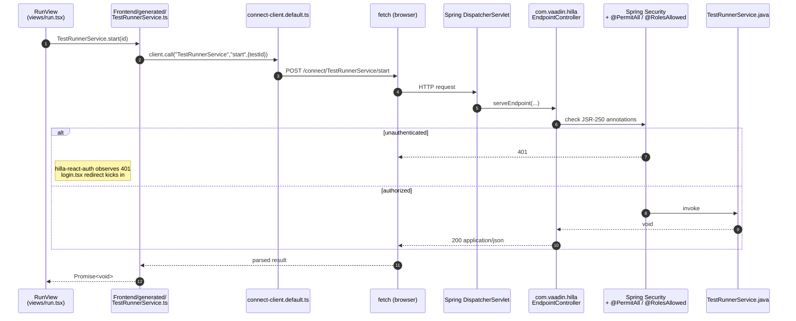

# Hilla generated layer

> Branch: `dev-split` &middot; Snapshot: 2026-04-25 &middot; 04-frontend

## Purpose

`src/main/frontend/generated/` is the seam between Java and TypeScript. It
exists so a React component can `await TestRunnerService.start(id)` and get
type-safety, CSRF handling and JSR-250 enforcement for free. This page
explains what is in there, who writes it, and the **golden rule:** never edit
anything inside `generated/`.

## Contents

- [Diagram — Hilla RPC round-trip](#diagram--hilla-rpc-round-trip)
- [What lives under `generated/`](#what-lives-under-generated)
- [Walked example: `TestRunnerService.start(id)`](#walked-example-testrunnerservicestartid)
- [Auth / error propagation](#auth--error-propagation)
- [Where to look in the code](#where-to-look-in-the-code)
- [Open questions](#open-questions)

## Diagram — Hilla RPC round-trip



(Source: [`doc/diagrams/src/hilla-rpc.mmd`](../diagrams/src/hilla-rpc.mmd).)

## What lives under `generated/`

These categories appear in **both** module trees and have an identical role:

| Path | Origin | Purpose |
|---|---|---|
| `<Service>.ts` (one per `@BrowserCallable`) | Hilla generator | Thin TS wrapper that calls `client.call("ServiceName","method",args)`. |
| `endpoints.ts` | Hilla generator | Re-exports every service module under a single import (`from "Frontend/generated/endpoints"`). |
| `ch/rupfizupfi/deck/...` (DTO mirrors) | Hilla generator | TypeScript classes/interfaces mirroring every Java DTO/entity referenced by an endpoint. Includes a `*Model` for each entity (form binding metadata). |
| `connect-client.default.ts` | Hilla generator | Singleton `ConnectClient` that owns the fetch wrapper, CSRF token and base path (`/connect/`). |
| `file-routes.json`, `file-routes.ts` | `vite-plugin-file-router` (Vaadin) | Compiled route tree from the `views/` directory. |
| `flow/*` | Hilla generator | Bridge to Vaadin Flow for Flow-driven layouts (this codebase uses it only as the `withFallback(Flow)` 404 in `routes.tsx`). |
| `routes.tsx` | Hilla generator | React-Router routes assembled from `file-routes.ts` — **but** in this repo `command-deck/src/main/frontend/routes.tsx` is **hand-written** (see [routing-and-layout.md](./routing-and-layout.md)) and the generated one is not used at runtime. |
| `theme-*.generated.js`, `vaadin*.ts`, `jar-resources/`, `vaadin-react.tsx` | Vaadin | Boot scripts, theme bundle, copies of files extracted from add-on JARs. |
| `vaadin-featureflags.js`, `generated-file-list.txt` | Vaadin | Manifests used by Vaadin's runtime. |

For the gory inventory per module see `doc/_inventory.md` &sect;4. Generated
files are also currently *partially* tracked in git (see open question #2 in
that file).

**Golden rule.** Anything under `generated/` is overwritten on every JVM start
in dev mode and on every `vaadin build` in production. If you find yourself
about to edit one of these files, stop and edit the Java source instead.

## Walked example: `TestRunnerService.start(id)`

Three files, one continuous round-trip.

1. **Java source** (`@BrowserCallable`) —
   `command-deck/src/main/java/ch/rupfizupfi/deck/api/services/TestRunnerService.java:11-23`
   ```java
   @BrowserCallable
   @PermitAll
   public class TestRunnerService {
       public void start(int testId) {
           testRunnerThread.startThread(
               testResultRepository.findById((long) testId)
                   .orElseThrow(() -> new RuntimeException("Test not found"))
           );
       }
       // status() / stop() / StatusResponse omitted
   }
   ```

2. **Generated TS client** —
   `command-deck/src/main/frontend/generated/TestRunnerService.ts:1-7`
   ```ts
   import client_1 from "./connect-client.default.js";
   async function start_1(testId: number, init?: EndpointRequestInit_1): Promise<void> {
       return client_1.call("TestRunnerService", "start", { testId }, init);
   }
   export { start_1 as start, /* status, stop */ };
   ```
   Notice how `int testId` becomes `testId: number` and the `void` return is
   preserved. Hilla also generated a sibling
   `ch/rupfizupfi/deck/api/services/TestRunnerService/StatusResponse.ts`
   for the inner DTO (because `status()` returns one).

3. **Call site** in a view —
   `command-deck/src/main/frontend/components/dashboard/LiveTestResult.tsx:97`
   ```ts
   import { TestRunnerService } from "Frontend/generated/endpoints";
   // ...
   TestRunnerService.start(testResult.id!);
   ```
   `Frontend/` is a Vaadin-conventional alias for `src/main/frontend/`. The
   import resolves to `generated/endpoints.ts:13`, which re-exports the file
   above.

## Auth / error propagation

Hilla pipes JSR-250 annotations directly into the Spring Security
authorization layer. Behaviour observed in this codebase:

- **`@AnonymousAllowed`** — one browser-callable surface uses it:
  `cms/src/main/java/ch/rupfizupfi/deck/api/UserEndpoint.java:22`, which has
  to be reachable before login so `useAuth()` can ask who (if anyone) is
  signed in. Everywhere else `@PermitAll` plus `loginRequired: true` on the
  route is the prevailing idiom.
- **`@PermitAll`** — `TestRunnerService`, `DeviceInfoService`,
  `SuckService`, `SettingService`, etc. The endpoint is reachable for any
  authenticated principal; the route metadata (`config.loginRequired`) keeps
  unauthenticated users out of the view in the first place.
- **`@RolesAllowed("ROLE_ADMIN")`** — only `UserService` (see
  `cms/src/main/java/ch/rupfizupfi/deck/api/services/UserService.java:12`).
  Calling `UserService.list(...)` as a non-admin yields HTTP 403 from
  `EndpointController`; the generated client surfaces that as a thrown
  `EndpointError` from the awaited promise.
- **Unauthenticated** call — `EndpointController` returns HTTP 401.
  `@vaadin/hilla-react-auth` (configured via
  `cms/src/main/frontend/util/auth.ts`, which wraps
  `UserEndpoint.getAuthenticatedUser`) detects the loss of session, the route
  guard set up by `routes.tsx#protect()` redirects to `/login`, and
  `cms/src/main/frontend/views/login.tsx` renders `<LoginOverlay/>` against
  the standard Spring-Security form login. After a successful submit the
  `LoginOverlay`'s `onLogin` callback navigates to `redirectUrl` if set.
- **Method-level `@CheckUserCanOnlyAccessOwnData`** (cms AOP aspect, see
  [`../03-backend/security-and-tenancy.md`](../03-backend/security-and-tenancy.md)) raises an
  exception inside the endpoint method — Hilla turns it into a
  `EndpointException` with the message preserved, surfaced as a rejected
  promise on the client.

## Where to look in the code
- `command-deck/src/main/frontend/generated/TestRunnerService.ts` (1-7)
- `command-deck/src/main/frontend/generated/endpoints.ts:1-16`
- `command-deck/src/main/java/.../api/services/TestRunnerService.java:11-44`
- `cms/src/main/frontend/util/auth.ts:1-7`
- `cms/src/main/frontend/views/login.tsx:1-38`
- `cms/src/main/java/.../api/services/UserService.java:12` (the lone `@RolesAllowed` example)
- Generated DTO mirror example:
  `command-deck/src/main/frontend/generated/ch/rupfizupfi/deck/api/services/TestRunnerService/StatusResponse.ts`

## Open questions

1. **Fully untrack `generated/`.** Decided 2026-08-16: the generated trees
   stop being tracked. They are currently both gitignored *and* tracked,
   which is why `git status` shows modified files under
   `command-deck/src/main/frontend/generated/` after every build. Needs
   `git rm --cached` on both modules' `generated/` trees, then a clean
   build to confirm nothing the frontend needs was only ever available
   because it was committed. Anything building the frontend must run the
   Hilla generator first. (OQ-14)
2. **Alternative client from `dev/hilla/openapi.json`?** Hilla writes an
   OpenAPI spec there (`application.properties` excludes it from devtools
   restart). Still undecided whether pointing external tooling at it is
   worth it — no current consumer needs a non-Hilla client. (OQ-18)
