# Routing & layout

> Branch: `dev-split` &middot; Snapshot: 2026-04-25 &middot; 04-frontend

## Purpose

Document where pages come from (file-based routing), how the layout/menu is
built, how the deck app *merges* the cms app's routes at build time, and which
routes need a logged-in user (and which need an admin).

## Contents

- [Diagram — merged route tree (deck + cms)](#diagram--merged-route-tree-deck--cms)
- [Narrative](#narrative)
  - [File-based routing convention](#file-based-routing-convention)
  - [MainLayout (`@layout.tsx`)](#mainlayout-layouttsx)
  - [Cross-module route merge (deck only)](#cross-module-route-merge-deck-only)
  - [Auth-gated routes](#auth-gated-routes)
  - [Page-level auth observations](#page-level-auth-observations)
- [Where to look in the code](#where-to-look-in-the-code)
- [Route merge is one-directional, permanently](#route-merge-is-one-directional-permanently)
- [Open questions](#open-questions)

## Diagram — merged route tree (deck + cms)

```mermaid
flowchart TD
    root["/ (MainLayout @layout.tsx)"]
    root --> deck["'' Deck (@index.tsx)<br/>menu order 0"]
    root --> control["control (control.tsx)<br/>excluded from menu"]
    root --> resultDeck["result/:resultId/tracking<br/>(views/result/{resultId}/tracking.tsx)"]
    root --> run["run (run.tsx)<br/>menu order 10"]

    root -.merged from cms.-> admin["admin/user (cms)"]
    root -.merged from cms.-> customer["customer (cms)"]
    root -.merged from cms.-> login["login (cms — public)"]
    root -.merged from cms.-> project["project/<br/>:projectId/sample (cms)"]
    root -.merged from cms.-> resultCms["result/:resultId/{image,result} (cms)"]
    root -.merged from cms.-> sample["sample (cms)"]
    root -.merged from cms.-> system["system/setting (cms)"]
    root -.merged from cms.-> test["test/{cyclic,destructive,timeCyclic} (cms)"]

    classDef cms fill:#eef,stroke:#88a,stroke-dasharray:3 3;
    class admin,customer,login,project,resultCms,sample,system,test cms;
```



Sources: [`doc/diagrams/src/route-tree-deck.mmd`](../diagrams/src/route-tree-deck.mmd) and
[`doc/diagrams/src/route-tree-cms.mmd`](../diagrams/src/route-tree-cms.mmd) for the cms-only tree.

## Narrative

### File-based routing convention

Vaadin's `@vaadin/hilla-file-router` walks `src/main/frontend/views/` and
turns the directory layout into a route tree by these rules:

| File / dir | Becomes |
|---|---|
| `views/foo.tsx` | route `/foo` |
| `views/foo/@index.tsx` | route `/foo` (the index leaf for a subtree) |
| `views/@layout.tsx` | layout component wrapping all children |
| `views/{name}/...` | dynamic segment, e.g. `views/result/{resultId}/result.tsx` is `/result/:resultId/result` |
| Exported `config: ViewConfig` | controls title, icon, menu order, `loginRequired` |

The compiled tree is dumped into `src/main/frontend/generated/file-routes.json`
on every build (per module) and consumed by the layout's `createMenuItems()`
to populate the side nav.

### MainLayout (`@layout.tsx`)

`command-deck/.../views/@layout.tsx:1-75` and `cms/.../views/@layout.tsx:1-74`
are *almost identical*. Both:

- Render an `<AppLayout primarySection="drawer">` with a `<SideNav>` populated
  from `createMenuItems()`.
- Bind `document.title` to the active view's `config.title` via the
  `documentTitleSignal` from `@vaadin/hilla-react-signals`.
- Pull `useAuth` from the **shared** `cms/util/auth.ts` (note the `cms`
  alias — both modules import the same hook, so login state is single-sourced).
- Render a "Sign out" button or a `<Link to="/login">Sign in</Link>` based on
  `state.user`.

The deck-side layout adds **one** extra element: an `<InfoBoard/>` mounted
inside the drawer, showing live frequency-converter telemetry
(`command-deck/.../views/@layout.tsx:8` import,
`@layout.tsx:42` mount). cms does not have InfoBoard because it has no
hardware to talk to.

### Cross-module route merge (deck only)

The deck's `routes.tsx` does **not** simply use the local `file-routes.json`.

```ts
// command-deck/src/main/frontend/routes.tsx:1-9
import fileRoutes from 'Frontend/generated/file-routes';
import cmsFileRoutes from "cms/generated/file-routes";

export const {router, routes} = new RouterConfigurationBuilder()
    .withFileRoutes(cmsFileRoutes)
    .withFileRoutes(fileRoutes)
    // ...
    .protect()
    .build();
```

Two layers happen here:

1. **Build-time merge.** `customFileSystemRouterPlugin.ts` (Vite plugin
   registered in `command-deck/vite.config.ts:66`) hooks the Vaadin file-router plugin's
   `buildStart` and the HMR `fs-route-update` event. It reads the cms
   `file-routes.json` from the sibling module and merges it into the deck's
   own `file-routes.json` *in place* (`mergeFileRoutes()` at
   `customFileSystemRouterPlugin.ts:73-102`). After this pass, the deck's
   generated `file-routes.json` already contains the cms tree as siblings of
   `run` / `control`.
2. **Runtime stack.** `withFileRoutes` is called twice in `routes.tsx`. The
   `RouterConfigurationBuilder` deep-merges them, so even if the build-time
   step is skipped (e.g. an isolated frontend rebuild), the runtime still
   sees both trees.

The cms module's own `routes.tsx` does **not** have this and uses only the
local file-routes — running `:cms:bootRun` therefore exposes only the
cms views; running `:command-deck:bootRun` exposes the deck views *plus* the
cms ones.

### Auth-gated routes

Two gates run in series:

- **`.protect()`** in `routes.tsx:37` is a `@vaadin/hilla-file-router` helper
  that wraps every route lacking `loginRequired: false` with a redirect to
  `/login` when `useAuth().state.user` is null. Every authored view in this
  repo declares `loginRequired: true` *except* `cms/.../views/login.tsx`,
  which sets `menu: { exclude: true }` and is the redirect target.
- **Hilla server-side** — even if a user navigates straight to a route,
  any `@BrowserCallable` call it makes will be re-checked against
  `@PermitAll` / `@RolesAllowed`. See
  [`hilla-generated-layer.md`](./hilla-generated-layer.md#auth--error-propagation).

The role model itself (USER vs ADMIN) is owned by Spring Security in the cms
module — `cms/src/main/java/ch/rupfizupfi/deck/security/SecurityConfiguration.java:27`
declares a `SecurityFilterChain` bean and applies the Vaadin defaults with
`.with(VaadinSecurityConfigurer.vaadin(), v -> v.loginView("/login"))`.
(Vaadin 25 removed `VaadinWebSecurity`, so there is no superclass to extend
any more.) The full multi-tenancy story (the AOP aspect, `DataWithOwner`) is in
[`../03-backend/security-and-tenancy.md`](../03-backend/security-and-tenancy.md).

### Page-level auth observations

| Route | Module | `loginRequired` | Notes |
|---|---|---|---|
| `/` | deck | true | Index page; subscribes to `loadCellObservable`. |
| `/control` | deck | true | Excluded from menu (`menu.exclude: true`). |
| `/run` | deck | true | The "headline" view; uses `AutoCrud` from cms alias. |
| `/result/:resultId/tracking` | deck | true | Webcam tracking; provisional — see [component-inventory.md](./component-inventory.md). |
| `/login` | cms | (excluded) | Anonymous; renders `<LoginOverlay/>`. |
| `/admin/user` | cms | true + ADMIN | `rolesAllowed: ['ADMIN']` and `menu: {exclude: true}` in `cms/src/main/frontend/views/admin/user.tsx:9`, so non-admins never see the link. Enforced server-side by `UserService @RolesAllowed`. Note the view config uses the `Role` enum name `ADMIN`, not the Spring authority `ROLE_ADMIN`. |
| Everything else (`/customer`, `/project/...`, `/sample`, `/system/setting`, `/test/*`, `/result/:id/{image,result}`) | cms | true | Tenant-scoped by `@CheckUserCanOnlyAccessOwnData`. |

## Where to look in the code
- `command-deck/src/main/frontend/views/@layout.tsx:1-75`
- `cms/src/main/frontend/views/@layout.tsx:1-74`
- `command-deck/src/main/frontend/routes.tsx:1-38`
- `command-deck/customFileSystemRouterPlugin.ts:73-143`
- `command-deck/src/main/frontend/generated/file-routes.json` (merged output)
- `cms/src/main/frontend/generated/file-routes.json` (cms-only tree)
- `cms/src/main/frontend/views/login.tsx:1-38`
- `cms/src/main/java/ch/rupfizupfi/deck/security/SecurityConfiguration.java:27-45`

## Route merge is one-directional, permanently

cms routes are merged into the deck tree at build time and never the
reverse, and that is permanent — the cloud cms has no reason to know about
hardware routes that only work on the tester. Don't generalise the merge
plugin to be bidirectional.

## Open questions

1. **`mergeRoutesArrays` loses parent metadata.** It merges by `route`
   string, so children of an existing parent merge correctly but changes to
   a parent's own metadata (icon, order, title) are dropped — the deck copy
   wins. No regression test guards this, and adding one means adopting a
   frontend test framework, which is not settled. Minimum viable fix is a
   comment at the merge site stating the limitation. (OQ-19)
2. **Silent path collisions.** Both modules contribute
   `/result/:resultId/`. Today the children divide cleanly (`tracking` vs
   `image`/`result`), but a name collision would silently take the
   first-seen child. A `console.warn` on collision would turn a silent
   wrong-page bug into a build-time complaint. (OQ-21)
