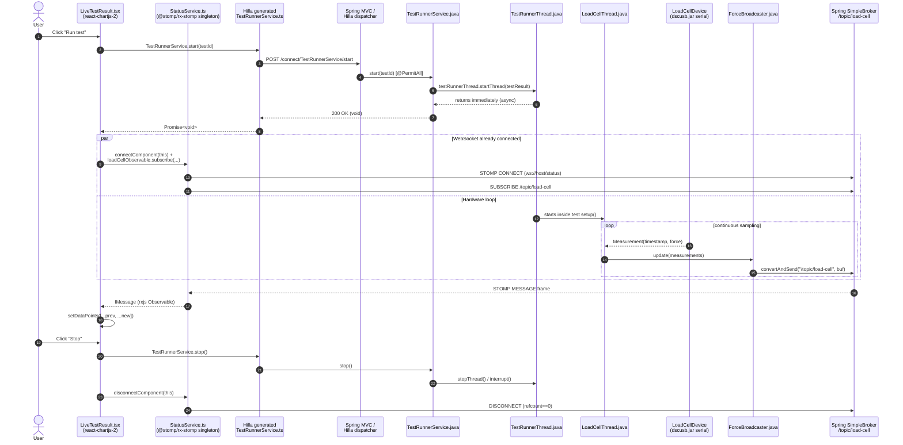

# State & real-time data flow

> Branch: `dev-split` &middot; Snapshot: 2026-04-25 &middot; 04-frontend

## Purpose

Trace a single sensor reading from the load cell on the bench all the way to
a pixel in the chart in `views/run.tsx`. This is the canonical example of how
the deck app combines **synchronous Hilla RPC** (start/stop the test) with
**asynchronous STOMP/WebSocket pushes** (the firehose of measurements).
Together with [`hilla-generated-layer.md`](./hilla-generated-layer.md) this
answers *"how does a button click in React reach a Java method, and how does a
sensor reading reach a chart?"*

## Contents

- [Diagram — STOMP sequence (button click + sensor stream)](#diagram--stomp-sequence-button-click--sensor-stream)
- [Narrative](#narrative)
  - [WebSocket topology](#websocket-topology)
  - [Data flow for `views/run.tsx`](#data-flow-for-viewsruntsx)
  - [Why the par block matters](#why-the-par-block-matters)
- [Where to look in the code](#where-to-look-in-the-code)
- [Open questions](#open-questions)

## Diagram — STOMP sequence (button click + sensor stream)



(Also at [`doc/diagrams/src/stomp-sequence.mmd`](../diagrams/src/stomp-sequence.mmd).
A separate Hilla-only round-trip diagram lives at
[`doc/diagrams/src/hilla-rpc.mmd`](../diagrams/src/hilla-rpc.mmd) and is
embedded in [`hilla-generated-layer.md`](./hilla-generated-layer.md).)

## Narrative

### WebSocket topology

`cms/src/main/java/ch/rupfizupfi/deck/messaging/WebSocketConfig.java` (the
single `@Configuration` for messaging in the whole project) registers a
**simple** in-memory broker, no external broker:

```java
config.enableSimpleBroker("/topic");
config.setApplicationDestinationPrefixes("/app");
registry.addEndpoint("/status");
registry.addEndpoint("/logs");
```

Two STOMP endpoints (`/status` and `/logs`), both without SockJS fallback.
Only `/status` is reachable: `VaadinSecurityConfigurer` closes the filter chain
with `anyRequest().denyAll()`, so anything that is neither a Vaadin route nor a
Hilla endpoint needs an authorization rule of its own, and
`SecurityConfiguration` grants exactly one — `/status`, `authenticated()`. Without
it the handshake was refused **403** for logged-in operators and no frame ever
arrived (see [security-and-tenancy](../03-backend/security-and-tenancy.md)).
`/logs` has no rule and no client: nothing connects to it, and the log topic is
delivered over the `/status` connection like every other topic.

Three topics are pushed today:

| Topic | Producer | Frame body |
|---|---|---|
| `/topic/load-cell` | `device/loadcell/ForceBroadcaster.java` | JSON array of `{timestamp, force}` measurements, batched every ~60ms |
| `/topic/frequency-converter-info` | `device/frequencyconverter/DeviceInfoBroadcaster.java` | JSON `Info` object (speed, motor current/voltage/torque, ...) |
| `/topic/logs` | `testrunner/TestLogger.java` (subscribed to via `Status.logObservable`) | plain string per log line |

The frontend's STOMP singleton is `command-deck/src/main/frontend/service/StatusService.ts`
— a hand-written wrapper around `@stomp/rx-stomp`'s `RxStomp`. It exposes
three rxjs `Observable<IMessage>`s (`loadCellObservable`,
`frequencyConverterInfoObservable`, `logObservable`) and a refcount
(`connectComponent` / `disconnectComponent`) that activates the underlying
WebSocket only while at least one component cares. It also publishes a
`liveStatus` observable — socket state plus a per-topic staleness deadline, so
a frozen number is distinguishable from a live one.

The broker URL is derived from the page, not configured
(`command-deck/src/main/frontend/service/StatusService.ts:5-11`):
`new URL('/status', document.baseURI)` with the scheme swapped to `wss:`
whenever the page is `https:`. The leading slash matters — the service can
first be constructed from a nested route, whose base directory is not the
server root. This is what makes live telemetry work behind TLS in the
`docker` profile as well as on plain `http://localhost:8080` in dev.

### Data flow for `views/run.tsx`

`command-deck/src/main/frontend/views/run.tsx:25-104` is the test-execution
view. Its lifecycle:

1. **Initial fetch (synchronous, via Hilla).** The view is built around an
   `<AutoCrud>` (imported via the cms alias) bound to `TestResultService`,
   `TestParameterService`, `SampleService` — all auto-generated TS
   clients. AutoCrud paginates the grid and renders the form via
   `TestResultModel`. No live data yet; just CRUD.
2. **Idle subscription.** Lines 30-33: `service.loadCellObservable.subscribe(...)`
   inside a `useEffect` whose cleanup unsubscribes, so the run view shows a
   status string if anything is already streaming without accumulating a
   subscription per render. `views/@index.tsx` holds the same pair.
3. **Mount the live chart.** When the user clicks "Run test", the form's
   `onClick` (line 93) calls `setTestResultData(readyTestResultData)`. That
   prop change re-renders `<LiveTestResult/>` with a non-null `testResult`.
4. **`LiveTestResult` resolves the test.**
   `components/dashboard/LiveTestResult.tsx:32-47` decides whether to use the
   user-clicked test or recover an already-running one via
   `TestRunnerService.status()`. If anything is running, a `<TestResultGraph/>`
   is mounted.
5. **`TestResultGraph` sets up the stream**
   (`LiveTestResult.tsx:62-105`). On mount:
   - subscribes to `loadCellObservable` — each `IMessage.body` is a
     JSON array of `{timestamp, force}` points pushed up the rxjs chain into
     `setDataPoints`.
   - subscribes to `logObservable` &rarr; appends to the `LogComponent`.
   - calls `TestRunnerService.start(testResult.id!)` — **the actual
     "go" signal**. The Hilla call returns void; the proof of life is the
     STOMP stream.
   - calls `service.connectComponent(TestResultGraph)` to refcount-activate
     the WebSocket.
6. **Teardown.** The same `useEffect` returns a cleanup that
   `unsubscribe()`s both observables and calls `disconnectComponent`.
   `StatusService.disconnectComponent`
   (`command-deck/src/main/frontend/service/StatusService.ts:223`) deactivates
   the underlying STOMP client when the last consumer leaves — so navigating
   away from `/run` cleanly closes the socket.
7. **Stop & close buttons.** Stop fires `TestRunnerService.stop()` (a Hilla
   call); Close fires `reset()` which sets `testResultData = undefined` and
   unmounts `<LiveTestResult/>`, triggering the cleanup path.

### Why the par block matters

In the sequence diagram above, the WebSocket subscribe and the Hilla
`start()` call run in parallel from the user's perspective. Step 25 of
`TestRunnerThread.run` literally does `Thread.sleep(50)` before doing
anything — the comment is *"Sleep for 50ms to allow the client to set
up the websocket connection"*. That's a tiny but real coupling between the
RPC and the WebSocket lifecycle.

## Where to look in the code
- `command-deck/src/main/frontend/views/run.tsx:25-104`
- `command-deck/src/main/frontend/components/dashboard/LiveTestResult.tsx:32-171`
- `command-deck/src/main/frontend/components/dashboard/InfoBoard.tsx:34-61` (`/topic/frequency-converter-info` consumer)
- `command-deck/src/main/frontend/service/StatusService.ts:1-239`
- `command-deck/src/main/java/.../api/services/TestRunnerService.java:11-44`
- `command-deck/src/main/java/.../testrunner/TestRunnerThread.java:23-78`
- `command-deck/src/main/java/.../testrunner/LoadCellThread.java:70-117`
- `command-deck/src/main/java/.../device/loadcell/ForceBroadcaster.java:9-25`
- `cms/src/main/java/.../messaging/WebSocketConfig.java:9-23`
- `cms/src/main/java/.../security/SecurityConfiguration.java` (the `/status` handshake rule)

## Open questions

1. **The 50 ms sleep in `TestRunnerThread.run()` is a soft race.**

   ```java
   // Sleep for 50ms to allow the client to set up the websocket connection
   Thread.sleep(50);
   ```

   A cold tab or a loaded CPU takes longer than that to subscribe, and the
   first measurements are dropped with no indication. A handshake message
   from the client, or awaiting a `connectAfter` promise, removes the
   guesswork. (OQ-23)

