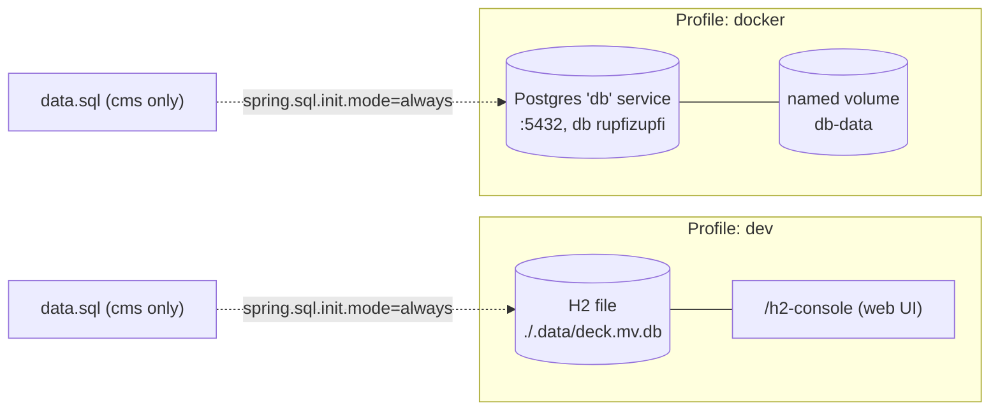

> Branch: `dev-split` — captured 2026-04-25.

# Database

## Purpose

How data is stored, where, and how to move it between environments. The
schema is documented in
[`03-backend/persistence-model.md`](../03-backend/persistence-model.md);
this page is purely operational.

## Contents

- [Diagram](#diagram)
- [Narrative](#narrative)
  - [Two backends, one schema](#two-backends-one-schema)
  - [Which database each deployment uses](#which-database-each-deployment-uses)
  - [Dev — H2 file](#dev--h2-file)
  - [Docker — PostgreSQL](#docker--postgresql)
  - [Seed data](#seed-data)
  - [Backup / restore (Postgres, docker profile)](#backup--restore-postgres-docker-profile)
  - [Resetting the dev DB](#resetting-the-dev-db)
- [Where to look in the code](#where-to-look-in-the-code)
- [Open questions](#open-questions)

## Diagram



## Narrative

### Two backends, one schema

Hibernate generates the schema from the JPA entities in
`cms/src/main/java/ch/rupfizupfi/deck/data/`. `spring.jpa.hibernate.ddl-auto=update`
runs in **both** profiles — there is no Flyway / Liquibase. See
[`persistence-model.md`](../03-backend/persistence-model.md) for the entity
catalogue.

**`ddl-auto=update` is a deliberate choice (2026-08-16), not an
oversight.** Flyway was considered and declined: the deployment is one
cloud CMS plus one tester, schema changes are infrequent, and nobody
needs to replay a migration history. The cost is that column renames and
data migrations have to be done by hand against the live database —
Hibernate will happily add a new column and leave the old one populated
and orphaned. Revisit if the deployment ever becomes multi-instance.

### Which database each deployment uses

`cms` runs in the cloud and `deck` runs on the tester, but they are meant
to share **one** Postgres in the cloud — the tester writes results
straight into the authoritative dataset. Today `application-docker.properties`
still points both at the Compose-local `db` service; closing that gap is
tracked as OQ-61. See
[`docker-and-profiles.md`](docker-and-profiles.md) for the topology.

### Dev — H2 file

Configured by `cms/src/main/resources/application-dev.properties:11`:

```
spring.datasource.url=jdbc:h2:file:./.data/deck
spring.datasource.username=sa
spring.datasource.password=
spring.h2.console.enabled=true
spring.sql.init.mode=always
```

* The DB is a file at `./.data/deck.mv.db` relative to the **process working
  directory** at the time of `bootRun`. Both `:cms` and `:command-deck` use
  the same path — when run from the repo root via Gradle, they share one
  H2 file and therefore one logical dataset.
* H2 console: navigate to `http://localhost:8080/h2-console` (URL fixed by
  `spring.h2.console.enabled=true`). JDBC URL `jdbc:h2:file:./.data/deck`,
  user `sa`, no password.
* H2 holds an exclusive lock on the file: only one Spring Boot process can
  open it at a time. Concurrent `:cms:bootRun` + `:command-deck:bootRun`
  fails with `JdbcSQLNonTransientConnectionException: Database may be
  already in use`. See [`runbook.md`](runbook.md).

### Docker — PostgreSQL

Configured by `cms/src/main/resources/application-docker.properties:7`:

```
spring.datasource.url=jdbc:postgresql://db:5432/rupfizupfi
spring.datasource.driverClassName=org.postgresql.Driver
spring.datasource.username=rupfizupfi
spring.datasource.password=${DB_PASSWORD}
spring.jpa.hibernate.naming_strategy=org.hibernate.cfg.ImprovedNamingStrategy
spring.jpa.defer-datasource-initialization=true
```

The Postgres service is described in
[`docker-and-profiles.md`](docker-and-profiles.md). Notable bits:

* Image: `postgres`, deliberately untagged (2026-08-16) — upstream is
  tracked and a breaking major bump is handled manually if it happens.
* User / DB: both `rupfizupfi`.
* Password: read from the `db-password` Docker secret
  (`../.secrets/db-password.txt`).
* Internal port `5432` is `expose:`'d on the docker network only —
  not published to the host.
* Persistence: named volume `db-data`. Survives `docker compose down`.
* Healthcheck: `pg_isready` every 10 s; the app services
  `depends_on: condition: service_healthy`.

### Seed data

`cms/src/main/resources/data.sql` runs whenever
`spring.sql.init.mode=always` (true in both `dev` and `docker` profiles).
With `defer-datasource-initialization=true`, Hibernate creates / updates
the schema first, then `data.sql` runs.

The seed file inserts:

* Two users — `user` (id 1, role `USER`) and `admin` (id 2, roles
  `USER` + `ADMIN`). Hashed passwords are bcrypt — see
  [`security-and-tenancy.md`](../03-backend/security-and-tenancy.md) for
  the password handling.
* Reference data: 11 `gear_type`, 3 `gear_standard`, 8 `material` rows.
* One demo `customer`.

The inserts use fixed IDs and are *not* idempotent — re-running them on
a populated DB violates the primary-key constraint. They do not re-run,
because both `Application` classes override the initializer bean:

```java
// Application.java — cms and command-deck both declare this
public boolean initializeDatabase() {
    if (repository.count() == 0L) {   // UserRepository
        return super.initializeDatabase();
    }
    return false;
}
```

So the seed is gated on `application_user` being empty, not on
`spring.sql.init.mode`. The residual hazard is narrow but real: a
database with users but missing reference data (e.g. someone truncated
`material`) will never be re-seeded, and a database with reference data
but no users will fail on the reference-data inserts. **Do not** add seed
rows for an existing deployment without checking IDs.

`:command-deck` has **no** `data.sql` of its own — it inherits cms's from
the `cms-library` jar on its classpath, so `classpath:data.sql` resolves
and a deck-only boot against an empty DB *does* seed. See
[`../02-modules/spring-boot-setup.md`](../02-modules/spring-boot-setup.md)
for why only one initializer bean exists despite both modules declaring
one.

### Backup / restore (Postgres, docker profile)

These commands assume the docker profile is up.

```bash
# custom-format dump (compressed, supports parallel restore)
docker compose -f docker/docker-compose.yaml exec db \
    pg_dump -U rupfizupfi -d rupfizupfi -Fc > backup.dump

# plain SQL dump
docker compose -f docker/docker-compose.yaml exec db \
    pg_dump -U rupfizupfi -d rupfizupfi > backup.sql

# restore custom-format dump (drops + recreates objects)
docker compose -f docker/docker-compose.yaml exec -T db \
    pg_restore -U rupfizupfi -d rupfizupfi --clean --verbose < backup.dump

# restore plain SQL
docker compose -f docker/docker-compose.yaml exec -T db \
    psql -U rupfizupfi -d rupfizupfi < backup.sql

# single-table export
docker compose -f docker/docker-compose.yaml exec db \
    pg_dump -U rupfizupfi -d rupfizupfi -t <table_name> > <table_name>.sql
```

The repo ships an example `docker/backup.sql` (untracked, in `git status`).

### Resetting the dev DB

```bash
# stop the bootRun process first, then:
rm -rf .data/
./gradlew :cms:bootRun
```

Hibernate recreates the schema and `data.sql` reseeds users + reference
data.

## Where to look in the code

| Concern | File |
|---|---|
| Dev datasource | `cms/src/main/resources/application-dev.properties:11` |
| Docker datasource | `cms/src/main/resources/application-docker.properties:7` |
| Schema policy | both files, `spring.jpa.hibernate.ddl-auto=update` |
| Seed | `cms/src/main/resources/data.sql` |
| Postgres service | `docker/docker-compose.yaml:46` |
| Compose secret -> env -> JDBC URL | `cms/src/docker/bin/startup.sh:26` |

## Open questions

1. **Make `data.sql` idempotent.** The initializer guard (above) stops
   the common re-run case, but the seed itself still relies on fixed IDs
   against a virgin table. `INSERT ... ON CONFLICT DO NOTHING` would make
   partial-seed states recoverable. Verify the syntax against H2 as well
   as Postgres. (OQ-52)
2. **Delete the profile-picture blobs.** `application_user` stores image
   bytes inline and `data.sql` seeds them. Decided 2026-08-16: the
   feature goes away entirely rather than migrating to `FileMetadata`.
   Needs the column dropped, the seed rows trimmed, and the UI that reads
   it removed. (OQ-34)
3. **`deck` should use the cloud Postgres**, not the Compose-local `db`.
   (OQ-61)
