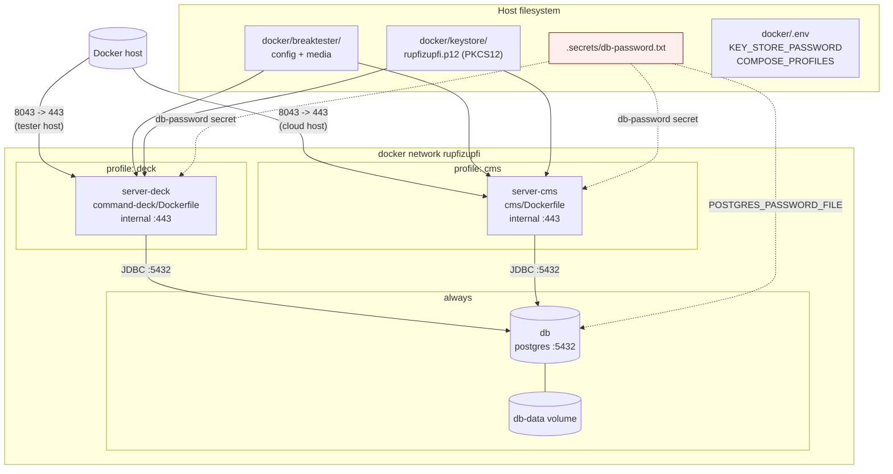

> Branch: `dev-split` — captured 2026-04-25.

# Docker and Spring profiles

## Purpose

Document the production deployment shape: one `docker-compose.yaml`, two
Compose profiles (`cms` and `deck`) that run on **different hosts**, one
Postgres service, and the host-side state (secret file + keystore + bind
mounts) the operator must provide.

## Contents

- [Deployment topology (decided 2026-08-16)](#deployment-topology-decided-2026-08-16)
- [Diagram — deployment topology](#diagram--deployment-topology)
- [Narrative](#narrative)
  - [One compose file, two profiles](#one-compose-file-two-profiles)
  - [Image build and entrypoint](#image-build-and-entrypoint)
  - [Spring profiles](#spring-profiles)
  - [Volumes & secrets](#volumes--secrets)
  - [Required host preparation](#required-host-preparation)
- [Where to look in the code](#where-to-look-in-the-code)
- [Open questions](#open-questions)

## Deployment topology (decided 2026-08-16)

The two profiles are not two roles for one machine — they are two
separate deployments:

| Profile | Runs where | Why |
|---|---|---|
| `cms` | Cloud host | Content management: projects, samples, customers, materials, results. Reachable by users who are nowhere near the machine. |
| `deck` | The physical tester, on the shop floor | Needs local USB/serial access to the load cell, CFW11 frequency converter and relay board. |

The on-machine `deck` connects to the **cloud database**, so there is one
authoritative dataset rather than a sync problem. That also means the
tester needs network reachability to the cloud host in order to run a
test.

> **Config does not match this yet.** `application-docker.properties` in
> both modules points at `jdbc:postgresql://db:5432/rupfizupfi` — the
> Compose-local `db` service — and the compose file starts that `db`
> service for both profiles. Pointing `deck` at the cloud Postgres is
> outstanding work, not current behaviour. Tracked as OQ-61 in
> [`../06-feature-work/address-open-questions/TASKS.md`](../06-feature-work/address-open-questions/TASKS.md).

## Diagram — deployment topology



Source: [`doc/diagrams/src/deployment.mmd`](../diagrams/src/deployment.mmd).

## Narrative

### One compose file, two profiles

`docker/docker-compose.yaml` defines three services:

| Service | Profile | Build | Internal port | Host port | Env |
|---|---|---|---|---|---|
| `server-cms` | `cms` | `cms/Dockerfile` (context `..`) | 443 | 8043 | `SPRING_PROFILES_ACTIVE=docker`, `KEY_STORE_PASSWORD`, `DB_PASSWORD_FILE=/run/secrets/db-password` |
| `server-deck` | `deck` | `command-deck/Dockerfile` (context `..`) | 443 | 8043 | same as above |
| `db` | (no profile gate; always on) | image `postgres` (no tag) | 5432 (`expose:`, not published) | — | `POSTGRES_DB=rupfizupfi`, `POSTGRES_USER=rupfizupfi`, `POSTGRES_PASSWORD_FILE=/run/secrets/db-password` |

Activate exactly one of cms/deck per host — `cms` on the cloud host,
`deck` on the tester:

```bash
docker compose -f docker/docker-compose.yaml --profile deck up -d
# or
docker compose -f docker/docker-compose.yaml --profile cms up -d
```

Both app services bind host port `8043:443`. That is not a conflict in
practice, because they never share a host — see the topology table
above.

`docker/.env` ships with `COMPOSE_PROFILES=deck,rclone`. No `rclone`
service exists in the compose file, so the profile currently activates
nothing. It is **not** dead config to be deleted: rclone is intended for
backing up test result files off the tester. The service definition is
missing and the intended remote/schedule is unrecorded — see OQ-56.

### Image build and entrypoint

Both images are two-stage builds (`gradle:9.7.0-jdk26-corretto` →
`eclipse-temurin:26-jre`) sharing one entrypoint script that self-signs a TLS
keystore and unwraps the DB-password secret. Details, and the three details
that surprise people, are in [`docker-images.md`](docker-images.md).

### Spring profiles

Set on the container by the compose file:
`SPRING_PROFILES_ACTIVE=docker`. Local development uses the default
profile (`spring.profiles.default=dev` in `application.properties`).

Both modules carry byte-identical copies of `application.properties`,
`application-dev.properties`, `application-docker.properties`
(`application-docker.properties` differs only in line endings). The
functional differences come from code (e.g. command-deck has the
test-runner singletons; cms has the entity classes) plus `data.sql` only
existing in cms. **Decided (2026-08-16):** deduplicate — the deck copies
go away and the cms classpath copies become canonical (OQ-4).

| Profile | DB | Port | TLS | Notable extras |
|---|---|---|---|---|
| (default = `dev`) | H2 file `jdbc:h2:file:./.data/deck` (user `sa`, no password) | `${PORT:8080}` | none | H2 console at `/h2-console`, devtools, `vaadin.devmode.devTools.enabled=true`, `logging.level.web=DEBUG` |
| `docker` | PostgreSQL `jdbc:postgresql://db:5432/rupfizupfi` (user `rupfizupfi`, password from secret) | `${PORT:443}` | PKCS12 at `/home/appuser/keystore/rupfizupfi.p12`, alias `rupfizupfi`, password `${KEY_STORE_PASSWORD}` | `defer-datasource-initialization`, `ImprovedNamingStrategy`, `ddl-auto=update` |

See [`db.md`](db.md) for the database angle.

### Volumes & secrets

* **Bind mount `./breaktester:/home/appuser/breaktester`.** Holds the
  user's settings JSON (`settings.json`), uploads, and CSV result files
  written by `LoadCellThread`. Persists across container restarts because
  it lives on the host.
* **Bind mount `./keystore:/home/appuser/keystore`.** Holds
  `rupfizupfi.p12`. The startup script auto-creates one if missing.
* **Named volume `db-data`.** Postgres data directory. Survives
  `docker compose down`.
* **Secret `db-password`** (mapped to `../.secrets/db-password.txt`). Both
  Postgres (`POSTGRES_PASSWORD_FILE`) and the app server
  (`DB_PASSWORD_FILE`) read from `/run/secrets/db-password`.

### Required host preparation

Before `docker compose up -d`, an operator must:

1. Create `<repo>/.secrets/db-password.txt` containing the desired
   Postgres password. (`.gitignore` excludes `.secrets/`.)
2. Optionally drop a real PKCS12 cert at `docker/keystore/rupfizupfi.p12`
   (matched to `KEY_STORE_PASSWORD` in `docker/.env`). If absent, the
   startup script generates a self-signed one. **Accepted as the normal
   operating mode (2026-08-16)** — the tester is reached over a trusted
   local network, so the auto-signed cert is intended, not a fallback.
3. Set or accept `KEY_STORE_PASSWORD=changeit` in `docker/.env` (default
   matches the auto-generated keystore).
4. Run the profile that matches the host: `deck` on the tester, `cms` in
   the cloud.

See [`runbook.md`](runbook.md) for failure modes when these preconditions
are skipped.

## Where to look in the code

| Concern | File |
|---|---|
| Compose file | `docker/docker-compose.yaml` |
| Compose env defaults | `docker/.env` |
| CMS image | `cms/Dockerfile` |
| Deck image | `command-deck/Dockerfile` |
| Container entrypoint (shared) | `cms/src/docker/bin/startup.sh` |
| Active-profile property | `cms/src/main/resources/application.properties:1` (`spring.profiles.default=dev`) |
| Docker profile DB / TLS | `cms/src/main/resources/application-docker.properties` (and the byte-identical command-deck copy) |
| Dev profile H2 | `cms/src/main/resources/application-dev.properties` |
| H2 console | enabled in dev via `spring.h2.console.enabled=true` |

## Open questions

1. **Point `deck` at the cloud Postgres.** The decided topology has the
   on-machine deck using the cloud database, but
   `application-docker.properties` still hardcodes the Compose-local
   `db:5432`. Needs an externalised JDBC URL and a decision on what
   happens to a running test when the link drops. (OQ-61)
2. **`rclone` service is missing.** `docker/.env` activates the profile;
   the compose file never defines it. Intended purpose is off-tester
   backup of test result files — the remote target, credentials handling
   and schedule are all unrecorded. (OQ-56)
