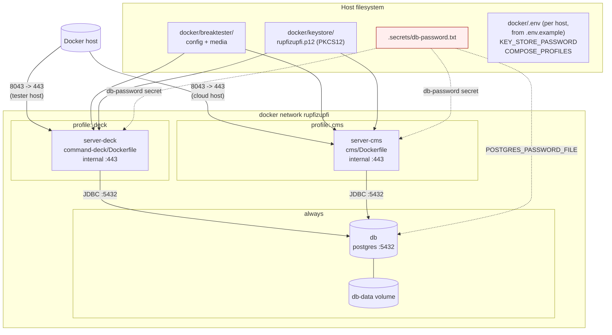

> Branch: `dev-split` — captured 2026-04-25.

# Docker and Spring profiles

## Purpose

Document the production deployment shape: one `docker-compose.yaml`, two
Compose profiles (`cms` and `deck`) that run on **different hosts**, one
Postgres service, and the host-side state (secret file + keystore + bind
mounts) the operator must provide.

## Contents

- [Deployment topology (decided 2026-08-16)](#deployment-topology-decided-2026-08-16)
- [Diagram — deployment topology](#diagram--deployment-topology)
- [Narrative](#narrative)
  - [One compose file, two profiles](#one-compose-file-two-profiles)
  - [Image build and entrypoint](#image-build-and-entrypoint)
  - [Spring profiles](#spring-profiles)
  - [Volumes & secrets](#volumes--secrets)
  - [Required host preparation](#required-host-preparation)
- [Where to look in the code](#where-to-look-in-the-code)
- [Open questions](#open-questions)

## Deployment topology (decided 2026-08-16)

The two profiles are not two roles for one machine — they are two
separate deployments:

| Profile | Runs where | Why |
|---|---|---|
| `cms` | Cloud host | Content management: projects, samples, customers, materials, results. Reachable by users who are nowhere near the machine. |
| `deck` | The physical tester, on the shop floor | Needs local USB/serial access to the load cell, CFW11 frequency converter and relay board. |

> **The `deck` image cannot reach that hardware.** Both driver plugins are
> Windows-only and this image is Linux, so each refuses to register and the
> container fails at startup rather than mid-run (**OQ-79**). Running natively on
> the Windows bench is the only path that drives hardware today:
> [`bench-deployment.md`](bench-deployment.md).

The on-machine `deck` connects to the **cloud database**, so there is one
authoritative dataset rather than a sync problem. That also means the
tester needs network reachability to the cloud host in order to run a
test.

> **The mechanism exists; the value is owner-owed.** `spring.datasource.url` is
> now `${DB_URL:...}`, and the deck service passes `DECK_DB_URL`. Unset, it still
> falls back to the Compose-local `db` — fine for a smoke test, wrong for a real
> run. Supplying the cloud URL is what remains of OQ-61. There is deliberately no
> fallback on connection failure: a deck that quietly wrote results elsewhere
> would be worse than one that refuses to start.

## Diagram — deployment topology


```mermaid
flowchart TB
    Host[("Docker host")]

    subgraph HostFS["Host filesystem"]
        BT["docker/breaktester/<br/>config + media"]
        KS["docker/keystore/<br/>rupfizupfi.p12 (PKCS12)"]
        SEC[".secrets/db-password.txt"]
        ENV["docker/.env (per host,<br/>from .env.example)<br/>KEY_STORE_PASSWORD<br/>COMPOSE_PROFILES"]
    end

    subgraph Net["docker network rupfizupfi"]
        subgraph DeckProfile["profile: deck"]
            SD["server-deck<br/>command-deck/Dockerfile<br/>internal :443"]
        end
        subgraph CmsProfile["profile: cms"]
            SC["server-cms<br/>cms/Dockerfile<br/>internal :443"]
        end
        subgraph Always["always"]
            DB[("db<br/>postgres :5432")]
            DBV[(db-data volume)]
        end
    end

    Host -- "8043 -> 443<br/>(tester host)" --> SD
    Host -- "8043 -> 443<br/>(cloud host)" --> SC

    SD -- "JDBC :5432" --> DB
    SC -- "JDBC :5432" --> DB
    DB --- DBV

    BT --> SD
    BT --> SC
    KS --> SD
    KS --> SC

    SEC -. db-password secret .-> SD
    SEC -. db-password secret .-> SC
    SEC -. POSTGRES_PASSWORD_FILE .-> DB

    classDef secret fill:#fee,stroke:#900
    class SEC secret
```

Source: [`doc/diagrams/src/deployment.mmd`](../diagrams/src/deployment.mmd).

## Narrative

### One compose file, two profiles

`docker/docker-compose.yaml` defines three services:

| Service | Profile | Build | Internal port | Host port | Env |
|---|---|---|---|---|---|
| `server-cms` | `cms` | `cms/Dockerfile` (context `..`) | 443 | 8043 | `SPRING_PROFILES_ACTIVE=docker`, `KEY_STORE_PASSWORD`, `DB_PASSWORD_FILE=/run/secrets/db-password` |
| `server-deck` | `deck` | `command-deck/Dockerfile` (context `..`) | 443 | 8043 | same as above |
| `db` | (no profile gate; always on) | image `postgres` (no tag) | 5432 (`expose:`, not published) | — | `POSTGRES_DB=rupfizupfi`, `POSTGRES_USER=rupfizupfi`, `POSTGRES_PASSWORD_FILE=/run/secrets/db-password` |

Activate exactly one per host — `cms` on the cloud host, `deck` on the tester.
Both bind host `8043:443`, which is not a conflict precisely because they never
share a host:

```bash
docker compose -f docker/docker-compose.yaml --profile deck up -d
```

`COMPOSE_PROFILES` in `docker/.env` picks the profile; `.env.example` sets
`deck`, dropping the `rclone` entry the old tracked `.env` carried — no such
service is defined, so it activated nothing. The intent is **not** dead config
(off-tester backup of result files) but the definition, remote and schedule are
unrecorded, so nothing can activate it yet (OQ-56).

### Image build and entrypoint

Both images are two-stage builds (`gradle:9.7.0-jdk26-corretto` →
`eclipse-temurin:26-jre`) sharing one entrypoint script that self-signs a TLS
keystore and unwraps the DB-password secret. Details, and the three details
that surprise people, are in [`docker-images.md`](docker-images.md).

### Spring profiles

Set on the container by the compose file:
`SPRING_PROFILES_ACTIVE=docker`. Local development uses the default
profile (`spring.profiles.default=dev` in `application.properties`).

Both modules carry byte-identical copies of `application.properties`,
`application-dev.properties`, `application-docker.properties`
(`application-docker.properties` differs only in line endings). The
functional differences come from code (e.g. command-deck has the
test-runner singletons; cms has the entity classes) plus `data.sql` only
existing in cms. **Decided (2026-08-16):** deduplicate — the deck copies
go away and the cms classpath copies become canonical (OQ-4).

| Profile | DB | Port | TLS | Notable extras |
|---|---|---|---|---|
| (default = `dev`) | H2 file `jdbc:h2:file:./.data/deck` (user `sa`, no password) | `${PORT:8080}` | none | H2 console at `/h2-console`, devtools, `vaadin.devmode.devTools.enabled=true`, `logging.level.web=DEBUG` |
| `docker` | PostgreSQL `${DB_URL:jdbc:postgresql://db:5432/rupfizupfi}` (user `rupfizupfi`, password from secret) | `${PORT:443}` | PKCS12 at `${KEY_STORE_PATH:/home/appuser/keystore/rupfizupfi.p12}`, alias `rupfizupfi`, password `${KEY_STORE_PASSWORD}` | `defer-datasource-initialization`, `ImprovedNamingStrategy`, `ddl-auto=update` |

`bench` is an alias, not a third profile (`spring.profiles.group.bench=docker`):
the two placeholders above plus `DECK_STORAGE_ROOT` are the only per-deployment
differences, so no `application-bench.properties` exists —
[`bench-deployment.md`](bench-deployment.md).

See [`db.md`](db.md) for the database angle.

### Volumes & secrets

* **Bind mount `./breaktester:/home/appuser/breaktester`.** Holds the
  user's settings JSON (`settings.json`), uploads, and CSV result files
  written by `LoadCellThread`. Persists across container restarts because
  it lives on the host. Reached via `DECK_STORAGE_ROOT=/home/appuser`: the images
  create `appuser` with `--home /nonexistent`, so `user.home` — what `~` used to
  resolve against — pointed outside this mount.
* **Bind mount `./keystore:/home/appuser/keystore`.** Holds
  `rupfizupfi.p12`. The startup script auto-creates one if missing.
* **Named volume `db-data`.** Postgres data directory. Survives
  `docker compose down`.
* **Secret `db-password`** (mapped to `../.secrets/db-password.txt`). Both
  Postgres (`POSTGRES_PASSWORD_FILE`) and the app server
  (`DB_PASSWORD_FILE`) read from `/run/secrets/db-password`.
* **Bind mount `./drivers-local:/app/drivers-local:ro`, deck only.** The
  licence-restricted `usbmodbus.jar`, which may not be redistributed and is
  therefore never in the image. Second entry on the container's `LOADER_PATH`;
  the public `dscusb.jar` is already at `/app/drivers` from the image build, and
  must not be duplicated here — the earlier `loader.path` entry wins, so a
  second copy is a silent version-skew trap. Drop the jar in and restart; there
  is nothing to rebuild. Owned by
  [`driver-jars.md`](../03-backend/driver-jars.md).
* **Build secret `github-token`**, deck build only. A file-backed secret like
  `db-password`, its path set by `GITHUB_TOKEN_FILE` and defaulting to the
  committed **empty** `docker/github-token.empty`. A PAT with
  `read:packages`, mounted only into the build stage so it never lands in a
  layer. `stageDrivers` needs it because GitHub Packages demands a token even
  for public reads. **Optional** — left at the default the build still succeeds,
  warns, and leaves `/app/drivers` empty; the container then refuses to start in
  real mode naming the missing provider. The path is indirected precisely for
  that: compose aborts *before the build starts* if a declared secret's file is
  missing, so a plain path would have made the token mandatory. The `cms`
  profile neither uses nor needs it.

### Required host preparation

Before `docker compose up -d`, an operator must:

1. Copy `docker/.env.example` to `docker/.env` — per-host and gitignored,
   because it carries `KEY_STORE_PASSWORD`. The defaults run as they are;
   `changeit` matches the auto-generated keystore.
2. Create `<repo>/.secrets/db-password.txt` containing the desired
   Postgres password. (`.gitignore` excludes `.secrets/`.)
3. Optionally drop a real PKCS12 cert at `docker/keystore/rupfizupfi.p12`
   (matched to `KEY_STORE_PASSWORD`). If absent, the startup script
   generates a self-signed one. **Accepted as the normal operating mode
   (2026-08-16)** — the tester is reached over a trusted local network,
   so the auto-signed cert is intended, not a fallback.
4. **Tester only:** put a PAT with `read:packages` in
   `<repo>/.secrets/github-token.txt` and set
   `GITHUB_TOKEN_FILE=../.secrets/github-token.txt` (a path, so `docker/.env`
   is its home — the token is not). Optionally set `GITHUB_ACTOR`; it
   defaults to a placeholder GitHub Packages accepts alongside a valid token.
   Skipping this leaves `/app/drivers` empty, which fails at startup, not at
   build time. Confirm with
   `docker compose exec server-deck ls /app/drivers`.
5. **Tester only:** copy `usbmodbus.jar` into `docker/drivers-local/`. Without
   it the container starts and then refuses, naming the missing `DriveProvider`
   — by design, it never falls back to a simulator.
6. Run the profile that matches the host: `deck` on the tester, `cms` in
   the cloud.

See [`runbook.md`](runbook.md) for failure modes when these preconditions
are skipped.

## Where to look in the code

| Concern | File |
|---|---|
| Compose file | `docker/docker-compose.yaml` |
| Compose env defaults | `docker/.env.example` (tracked); `docker/.env` is the per-host copy, gitignored |
| CMS image | `cms/Dockerfile` |
| Deck image | `command-deck/Dockerfile` |
| Container entrypoint (shared) | `cms/src/docker/bin/startup.sh` |
| Active-profile property | `cms/src/main/resources/application.properties:1` (`spring.profiles.default=dev`) |
| Docker profile DB / TLS | `cms/src/main/resources/application-docker.properties` (and the byte-identical command-deck copy) |
| Dev profile H2 | `cms/src/main/resources/application-dev.properties` |
| H2 console | enabled in dev via `spring.h2.console.enabled=true` |

## Open questions

1. **Point `deck` at the cloud Postgres.** The decided topology has the
   on-machine deck using the cloud database, but
   `application-docker.properties` still hardcodes the Compose-local
   `db:5432`. Needs an externalised JDBC URL and a decision on what
   happens to a running test when the link drops. (OQ-61)
2. **`rclone` service is missing.** The compose file never defines it, so
   `.env.example` does not activate it. Intended purpose is off-tester
   backup of test result files — the remote target, credentials handling
   and schedule are all unrecorded. (OQ-56)
