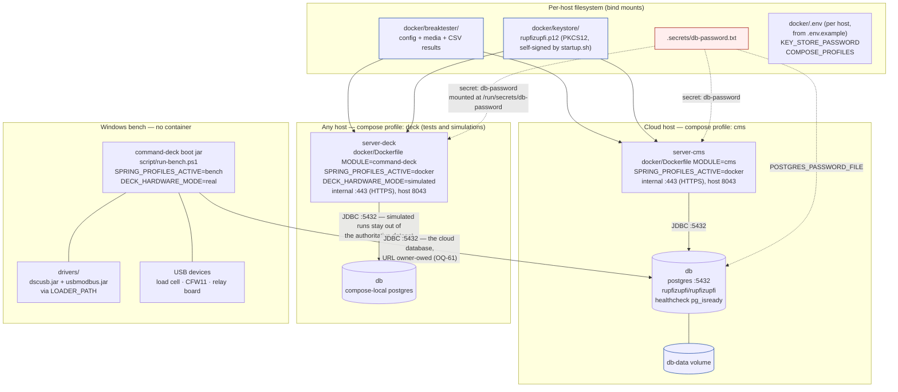

> Branch: `dev-split` — captured 2026-04-25.

# Docker and Spring profiles

## Purpose

Document the production deployment shape: one `docker-compose.yaml`, two
Compose profiles (`cms` and `deck`) that run on **different hosts**, one
Postgres service, and the host-side state (secret file + keystore + bind
mounts) the operator must provide. Neither container drives the machine — the
bench runs natively, [`bench-deployment.md`](bench-deployment.md).

## Contents

- [Deployment topology (decided 2026-08-16)](#deployment-topology-decided-2026-08-16)
- [Diagram — deployment topology](#diagram--deployment-topology)
- [Narrative](#narrative)
  - [One compose file, two profiles](#one-compose-file-two-profiles)
  - [Image build and entrypoint](#image-build-and-entrypoint)
  - [Spring profiles](#spring-profiles)
  - [Volumes & secrets](#volumes--secrets)
  - [Required host preparation](#required-host-preparation)
- [Where to look in the code](#where-to-look-in-the-code)
- [Open questions](#open-questions)

## Deployment topology (decided 2026-08-16)

The two profiles are not two roles for one machine — they are two
separate deployments:

| Profile | Runs where | Why |
|---|---|---|
| `cms` | Cloud host | Content management: projects, samples, customers, materials, results. Reachable by users who are nowhere near the machine. |
| `deck` | Any host — a CI box, a laptop, the cloud | Running the deck's own stack for **tests and simulations**: the full application, `deck.hardware.mode=simulated`, no driver plugin anywhere in the image. |

**Neither container touches hardware, and the `deck` container is not the
tester.** Both driver plugins are Windows-only, so a Linux image could not drive
the bench even if it carried them. **Decided (2026-08-31):** rather
than retire the `deck` profile, it becomes the simulation and test deployment, and
every piece of driver delivery leaves the image — no `stageDrivers`, no GitHub
Packages credential, no `drivers-local` mount, no `LOADER_PATH`. The machine is
driven by `command-deck` running **natively on the Windows bench**
([`bench-deployment.md`](bench-deployment.md)), the only deployment that supplies a
driver at all.

That settles the container half of the database question: a simulated run must
**not** write into the authoritative dataset, so the `deck` service uses the
Compose-local `db`, which is what it already defaulted to (`DECK_DB_URL` still
points it elsewhere for a shared test database).

> **What remains of OQ-61 belongs to the bench.** It is the deployment that must
> reach the cloud Postgres, and it takes its URL from `script/run-bench.ps1`
> (`DB_URL`, no local fallback — a deck that quietly wrote results elsewhere would
> be worse than one that refuses to start). The cloud host is still owner-owed.

## Diagram — deployment topology


```mermaid
flowchart TB
    subgraph Cloud["Cloud host — compose profile: cms"]
        SC["server-cms<br/>docker/Dockerfile MODULE=cms<br/>SPRING_PROFILES_ACTIVE=docker<br/>internal :443 (HTTPS), host 8043"]
        DB[("db<br/>postgres :5432<br/>rupfizupfi/rupfizupfi<br/>healthcheck pg_isready")]
        DBV[(db-data volume)]
        SC -- "JDBC :5432" --> DB
        DB --- DBV
    end

    subgraph Sim["Any host — compose profile: deck (tests and simulations)"]
        SD["server-deck<br/>docker/Dockerfile MODULE=command-deck<br/>SPRING_PROFILES_ACTIVE=docker<br/>DECK_HARDWARE_MODE=simulated<br/>internal :443 (HTTPS), host 8043"]
        SDB[("db<br/>compose-local postgres")]
        SD -- "JDBC :5432 — simulated runs stay out of<br/>the authoritative dataset" --> SDB
    end

    subgraph Bench["Windows bench — no container"]
        RB["command-deck boot jar<br/>script/run-bench.ps1<br/>SPRING_PROFILES_ACTIVE=bench<br/>DECK_HARDWARE_MODE=real"]
        DRV["drivers/<br/>dscusb.jar + usbmodbus.jar<br/>via LOADER_PATH"]
        HW["USB devices<br/>load cell · CFW11 · relay board"]
        RB --- DRV
        RB --- HW
    end

    subgraph HostFS["Per-host filesystem (bind mounts)"]
        BT["docker/breaktester/<br/>config + media + CSV results"]
        KS["docker/keystore/<br/>rupfizupfi.p12 (PKCS12, self-signed by startup.sh)"]
        SEC[".secrets/db-password.txt"]
        ENV["docker/.env (per host,<br/>from .env.example)<br/>KEY_STORE_PASSWORD<br/>COMPOSE_PROFILES"]
    end

    RB -- "JDBC :5432 — the cloud database,<br/>URL owner-owed (OQ-61)" --> DB

    BT --> SD
    BT --> SC
    KS --> SD
    KS --> SC

    SEC -. "secret: db-password<br/>mounted at /run/secrets/db-password" .-> SD
    SEC -. "secret: db-password" .-> SC
    SEC -. "POSTGRES_PASSWORD_FILE" .-> DB


    classDef secret fill:#fee,stroke:#900
    classDef volume fill:#eef,stroke:#039
    class SEC secret
    class BT,KS,DBV volume
```

Source: [`doc/diagrams/src/deployment.mmd`](../diagrams/src/deployment.mmd).

## Narrative

### One compose file, two profiles

`docker/docker-compose.yaml` defines three services:

| Service | Profile | Build | Internal port | Host port | Env |
|---|---|---|---|---|---|
| `server-cms` | `cms` | `docker/Dockerfile`, `MODULE=cms` (context `..`) | 443 | 8043 | `SPRING_PROFILES_ACTIVE=docker`, `KEY_STORE_PASSWORD`, `DB_PASSWORD_FILE=/run/secrets/db-password` |
| `server-deck` | `deck` | `docker/Dockerfile`, `MODULE=command-deck` (context `..`) | 443 | 8043 | the same, plus `DECK_HARDWARE_MODE=simulated` and `DB_URL` |
| `db` | (no profile gate; always on) | image `postgres` (no tag) | 5432 (`expose:`, not published) | — | `POSTGRES_DB=rupfizupfi`, `POSTGRES_USER=rupfizupfi`, `POSTGRES_PASSWORD_FILE=/run/secrets/db-password` |

Activate exactly one per host — `cms` on the cloud host, `deck` on the tester.
Both bind host `8043:443`, which is not a conflict precisely because they never
share a host:

```bash
docker compose -f docker/docker-compose.yaml --profile deck up -d
```

`COMPOSE_PROFILES` in `docker/.env` picks the profile; `.env.example` sets
`deck`, dropping the `rclone` entry the old tracked `.env` carried — no such
service is defined, so it activated nothing. The intent is **not** dead config
(off-tester backup of result files) but the definition, remote and schedule are
unrecorded, so nothing can activate it yet (OQ-56).

### Image build and entrypoint

**One Dockerfile, parameterised by `MODULE`.** `docker/Dockerfile` is a two-stage
build (`gradle:9.7.0-jdk26-corretto` → `eclipse-temurin:26-jre`) and the two
services differ only in that build arg — there were two near-identical copies until
the deck's extra directives, all of them driver delivery, became unnecessary. The
build resolves nothing from a private repository, so it needs **no credentials and
no build secret**. The shared entrypoint self-signs a TLS keystore and unwraps the
DB-password secret; details in [`docker-images.md`](docker-images.md).

### Spring profiles

Set on the container by the compose file:
`SPRING_PROFILES_ACTIVE=docker`. Local development uses the default
profile (`spring.profiles.default=dev` in `application.properties`).

Both modules carry byte-identical copies of `application.properties`,
`application-dev.properties`, `application-docker.properties`
(`application-docker.properties` differs only in line endings). The
functional differences come from code (e.g. command-deck has the
test-runner singletons; cms has the entity classes) plus `data.sql` only
existing in cms. **Decided (2026-08-16):** deduplicate — the deck copies
go away and the cms classpath copies become canonical (OQ-4).

| Profile | DB | Port | TLS | Notable extras |
|---|---|---|---|---|
| (default = `dev`) | H2 file `jdbc:h2:file:./.data/deck` (user `sa`, no password) | `${PORT:8080}` | none | H2 console at `/h2-console`, devtools, `vaadin.devmode.devTools.enabled=true`, `logging.level.web=DEBUG` |
| `docker` | PostgreSQL `${DB_URL:jdbc:postgresql://db:5432/rupfizupfi}` (user `rupfizupfi`, password from secret) | `${PORT:443}` | PKCS12 at `${KEY_STORE_PATH:/home/appuser/keystore/rupfizupfi.p12}`, alias `rupfizupfi`, password `${KEY_STORE_PASSWORD}` | `defer-datasource-initialization`, `ImprovedNamingStrategy`, `ddl-auto=update` |

`bench` is an alias, not a third profile (`spring.profiles.group.bench=docker`):
the two placeholders above plus `DECK_STORAGE_ROOT` are the only per-deployment
differences, so no `application-bench.properties` exists —
[`bench-deployment.md`](bench-deployment.md).

**That alias is also the safety boundary, so it is not cosmetic.** The one thing
the container and the bench must never share is `deck.hardware.mode`, so
`application-docker.properties` sets it for neither: each declares its own through
`DECK_HARDWARE_MODE` (an environment variable outranks every properties file), and
unset by both, `application.properties` supplies the fail-safe `real`.
`HardwareModeCheck` permits simulation under `docker` but **not** under `bench` — a
bench run's active set is `[bench, docker]` and the allowlist requires *every*
active profile to be permitted, so the container may simulate and the bench may
not, distinguished only by that extra entry. `HardwareModeCheckTest` pins both.

See [`db.md`](db.md) for the database angle.

### Volumes & secrets

* **Bind mount `./breaktester:/home/appuser/breaktester`.** Holds the
  user's settings JSON (`settings.json`), uploads, and CSV result files
  written by `LoadCellThread`. Persists across container restarts because
  it lives on the host. Reached via `DECK_STORAGE_ROOT=/home/appuser`: the images
  create `appuser` with `--home /nonexistent`, so `user.home` — what `~` used to
  resolve against — pointed outside this mount.
* **Bind mount `./keystore:/home/appuser/keystore`.** Holds
  `rupfizupfi.p12`. The startup script auto-creates one if missing.
* **Named volume `db-data`.** Postgres data directory. Survives
  `docker compose down`.
* **Secret `db-password`** (mapped to `../.secrets/db-password.txt`). Both
  Postgres (`POSTGRES_PASSWORD_FILE`) and the app server
  (`DB_PASSWORD_FILE`) read from `/run/secrets/db-password`.
**`db-password` is the only secret, and there is no build-time secret at all.**
The deck build used to mount a `read:packages` PAT to fetch a driver plugin, which
in turn needed a placeholder-file indirection so that a *missing* token could not
fail the build. Delivering no driver to the image deleted the token, the
placeholder, the `GITHUB_TOKEN_FILE` path variable and the `drivers-local` mount
in one go — the image build is credential-free.

### Required host preparation

Before `docker compose up -d`, an operator must:

1. Copy `docker/.env.example` to `docker/.env` — per-host and gitignored,
   because it carries `KEY_STORE_PASSWORD`. The defaults run as they are;
   `changeit` matches the auto-generated keystore.
2. Create `<repo>/.secrets/db-password.txt` containing the desired
   Postgres password. (`.gitignore` excludes `.secrets/`.)
3. Optionally drop a real PKCS12 cert at `docker/keystore/rupfizupfi.p12`
   (matched to `KEY_STORE_PASSWORD`). If absent, the startup script
   generates a self-signed one. **Accepted as the normal operating mode
   (2026-08-16)** — the tester is reached over a trusted local network,
   so the auto-signed cert is intended, not a fallback.
4. Run the profile that matches the host: `cms` in the cloud, `deck` wherever
   tests and simulations run.

Nothing about driver plugins appears here any more, for either profile. The bench
has its own, shorter list: [`bench-deployment.md`](bench-deployment.md).

See [`runbook.md`](runbook.md) for failure modes when these preconditions
are skipped.

## Where to look in the code

| Concern | File |
|---|---|
| Compose file | `docker/docker-compose.yaml` |
| Compose env defaults | `docker/.env.example` (tracked); `docker/.env` is the per-host copy, gitignored |
| Both images | `docker/Dockerfile` (one file, `MODULE` build arg) |
| Container entrypoint (shared) | `cms/src/docker/bin/startup.sh` |
| Active-profile property | `cms/src/main/resources/application.properties:1` (`spring.profiles.default=dev`) |
| Docker profile DB / TLS | `cms/src/main/resources/application-docker.properties` (and the byte-identical command-deck copy) |
| Dev profile H2 | `cms/src/main/resources/application-dev.properties` |
| H2 console | enabled in dev via `spring.h2.console.enabled=true` |

## Open questions

1. **Point the *bench* at the cloud Postgres.** The URL is externalised
   (`${DB_URL:...}`) and `script/run-bench.ps1` refuses to start without it, so
   what is left is owner-owed: the cloud host, and a decision on what happens to
   a running test when the link drops. No longer a container question —
   simulated runs belong in the local db. (OQ-61)
2. **`rclone` service is missing.** The compose file never defines it, so
   `.env.example` does not activate it. Intended purpose is off-tester
   backup of test result files — the remote target, credentials handling
   and schedule are all unrecorded. (OQ-56)
